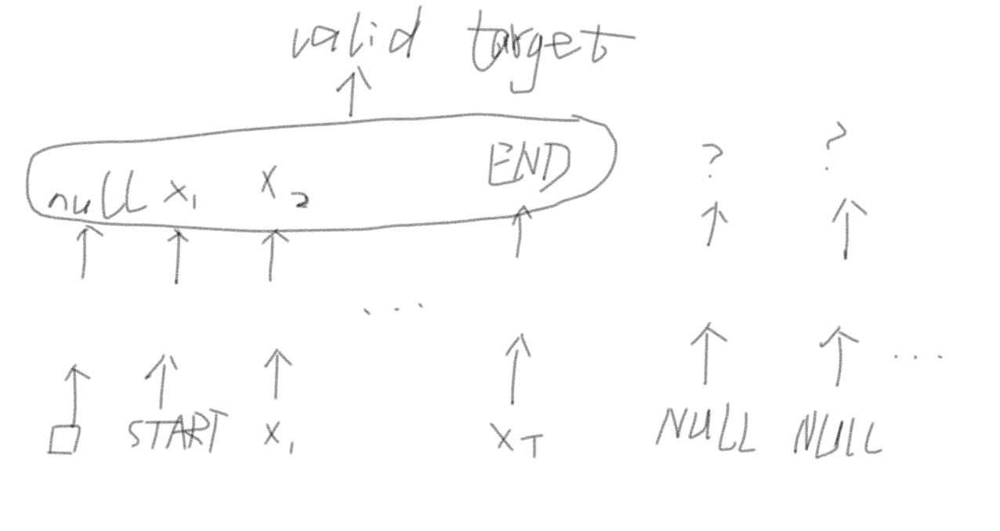

完成SAR项目

- [x] 完成卷积部分的复现
- [ ] 考虑到卷积操作和正常的resnet不同，这里有两种方案，第一种t7转pth，第二种更换backbone

由于是识别过程这里考虑直接从头开始训练 

- [x]  完成识别部分的实现

  这一部分分为四个任务

  - [x] 第一个是编码器的实现，这个是一个简单的lstm，应该可以用自带的循环来写
  - [x] 第二部分是lstm unit到 hiden state的实现
  - [x] 第三部分是attention的计算
  - [x] 第四部分是hiden state和 attention到输出

遇到问题：

pytorch在cuda模式下error trace做的不好，很容易定位错误

> 在debug的时候考虑使用cpu模式，然后再将整个代码全部转换成cuda()

pytorch某些错误下在模型运行时会随着迭代次数吃新的显存

> 主要的错误原因有两种
>
> 第一种是对返回的带梯度的tensor进行累积

```python
#第一种情况		
loss=model(input)
loss_sum+=loss
#正确用法
loss=model(input)
loss_sum+=loss.data[0]#loss.item()
#对上面的解释
loss=model1(input)+model(input2)
```

> 第二种情况是在\_\_init\_\_()函数中对变量进行初始化

```python
#第二种情况
class Recogniton(nn.Module):
    def __init__(self):
        super(Recogniton, self).__init__()
        self.encode_lstm = nn.LSTM(
            self.featrue_layers, self.hidden_dim, self.num_layers)
        self.hidden_en = (torch.zeros(self.num_layers, self.batch_size, self.hidden_dim).cuda(),torch.zeros(self.num_layers, self.batch_size, self.hidden_dim).cuda())
    def forward(self,x):
        x, self.hidden_en = self.encode_lstm(x, self.hidden_en)
        return x
#这种情况我暂时还没有找到原因
#解决方法
class Recogniton(nn.Module):
    def __init__(self):
        super(Recogniton, self).__init__()
        self.encode_lstm = nn.LSTM(
            self.featrue_layers, self.hidden_dim, self.num_layers)   
    def forward(self,x):
        self.hidden_en = (torch.zeros(self.num_layers, self.batch_size, self.hidden_dim).cuda(),torch.zeros(self.num_layers, self.batch_size, self.hidden_dim).cuda())
        x, self.hidden_en = self.encode_lstm(x, self.hidden_en)
        return x
```

代码复现的时候遗留了几个问题：

主要来说是minibatch 以及 变长训练的问题

对于不同尺寸的输入图片，是否需要强制resize，还是说尽可能的保持aspect_ratio		


第二个是训练标签的padding问题



在等长文本上训练告一段落，这种情况比较简单，即使全是直线文本，基于attention的识别系统也不会弱于ctc

即使是6000类也达到了95%以上的正确率，编辑距离也非常小，虽然是等长文本，但是文本在图片中的位置并不是固定的，attention依旧能够很好的对齐

在不等长文本上训练出现了问题，attention这个时候很难很好的对齐，对于过短的文本，也会强制resize成48 * 320，这样做是否没有问题，正如上面所考虑的第一个问题，到底是否需要keep ratio 然后padding还是说即使这样能够识别，在ctc的机制下是可以学习的（师兄说的），那么这种情况是否依旧适用于需要对其的attention机制

在测试的时候出现了问题