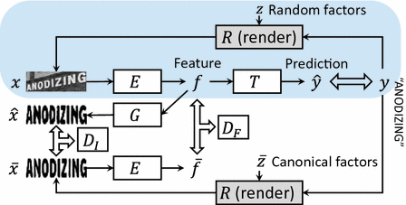

 ### [Synthetically Supervised Feature Learning for Scene Text Recognition](https://link.springer.com/chapter/10.1007%2F978-3-030-01228-1_27)

Yang Liu, Zhaowen Wang, Hailin Jin and Ian Wassell 

Computer Laboratory, University of Cambridge, UK

 对于识别过程来说，生成数据集有着很大的作用，即使没有真实图片，用生成数据集也可以取得很好的泛化能力，其主要原因是识别过程的图片相对简单，只有很小的扭曲形变。

 所以一般来说绝大多数的识别算法都是利用大规模生成的图片进行训练，忽略了生成图片的过程，虚拟图片和真实图片的一个很大的不同就在于我们可以得到虚拟图片**生成的参数**，这可以认为是额外的gt，或者说我们得到的图片是没有干扰的

 这篇文章将**图像生成过程**加入到识别网络中来，这样就可以运用**生成判别模型**，在识别的时候利用没有经过扭曲变换的原图也加入训练过程中作为监督信息

 </img>

 ### 新词汇

|                                          |      |
| :--------------------------------------- | ---- |
| leverage                                 | 利用 |
| supervision                              | 监督 |
| because of the absence of \|  is free of | 缺少 |
| hand-crafted                             | 手工 |
| manipulate nuisance factors              |      |
| distortion \| distortion                 |      |
| end-to-end fashion                       |      |
| aforementioned                           |      |
|                                          |      |

