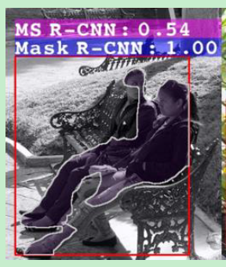
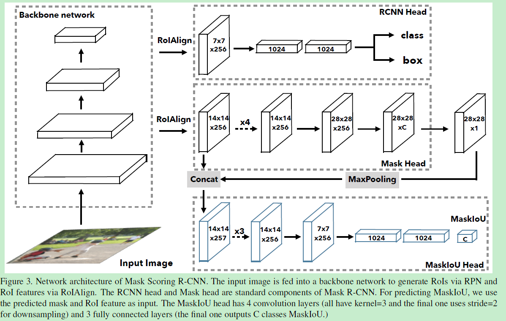

## [Mask Scoring R-CNN](https://arxiv.org/pdf/1903.00241.pdf)

最近几篇工作感觉都是从，cal metric 出发来思考问题，包括giou以及 mask scoring

思路是没什么问题，简单而且清晰

本文的主要问题是针对实例分割，计算最终ap的时候我们需要用到mask的分数，一般而言，我们都会简单的采用box分支的classification confidence来表示mask的得分，这也没有什么问题，因为对于mask-rcnn来说，如果框检测的不准，那么后面的分割是没有任何意义的

不过框检测的是否准不仅仅是有classification confidence来决定的，回归也会造成一定的影响，此外，就算检测框是正确的，mask的提取也有可能是错的，为了能够很好的提高最终的评价指标，一个有效的设计师非常重要的。

如上图所示，对于实体分割而言，即使是在bounding box中做分割也会有着很大可能会出现分割错误，所以这种新的设计思路是非常有道理的。

有了思路，接下来的问题就是如何来设计了。我们的目标是对mask进行有效的评价，最简单的也是最有效的就是把评价指标定义成目标，那么最后我们就要计算一个IoU，一个mask对于一个类只有一个IoU，很简单的构造就是用fc来实现，而要计算mask的iou，mask分支的特征是必不可少的，可以看到这里作者使用了很简单的网络设计

MaskIoU的输入由两部分组成，一是ROIAlign得到的RoI feature map，二是mask分支输出的mask。两者concat之后经过3层卷积和2层全连接输出MaskIoU。

**training过程：**

box分支和mask保持不变，输出的mask先经过阈值为0.5的binarize，再计算binary mask和gt的IoU作为target，采用L2 loss作为损失函数，loss weight设为1，3个分支同时end-to-end训练。

**inference过程：**

检测分支输出score最高的100个框，再送入mask分支，得到mask结果，RoI feature map再和mask送入MaskIoU分支得到mask iou，与box的classification score相乘就得到最后的mask score。这里也继承了mask Rcnn的优秀结构，可以阶段进行测试，处理中间结果，比直接端到端有着更好的效果，原版的mask rcnn是两阶段测试，这里就是三阶段测试。

从上面的分析，可以看出整个网络的结构十分的简单，作者也知道很简单，所以设计了大量的实验来增加文章的内容。

不过这里有一个很有意思的说法就是，我们使用了我们reproduce的mask rcnn来进行实验，众所周知，mask rcnn是官方开源的，而且作者的代码也是完全在mask rcnn上面改的，基本没有巨大的变动，作者贴出来的maskrcnn结果竟然比官方的还要好，不过数据集不完全相同。

作者放出了源码，里面有可变形卷积，可以好好学习一下https://github.com/zjhuang22/maskscoring_rcnn

|          |              |
| -------- | ------------ |
| penalize | 对……予以惩罚 |
|          |              |
|          |              |

