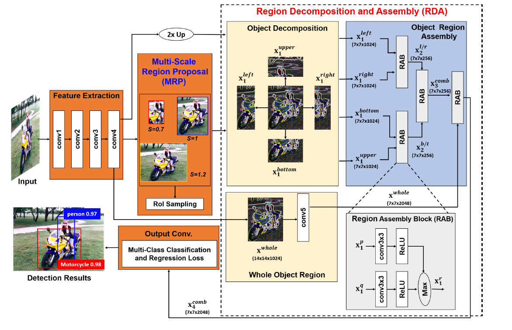

## [Object Detection based on Region Decomposition and Assembly](https://arxiv.org/pdf/1901.08225.pdf)

R-DAD思路

首先将object region分成很多小的区域，然后提取整个region和小区域的信息。然后学习他们之间的语义关系。

如何学习语义关系？

将多区域特征逐步与 region assembly blocks(RAB),相结合

这篇文章的立足点在于提高检测的正确性，作者提到，检测效果受到物体特征的低分辨率影响，造成这种低分辨率的原因常常是遮挡和不准确的proposal。

正因为遮挡物体的存在，所以作者提到了利用object region的全局信息可能不能准确地进行定位和分类，那么问题来了，DCN能不能解决这种问题呢

为了解决上面的问题，作者提出了(1) multi-scale-based region proposal和(2)
multi-region-based appearance model来分别提高rpn的准确率以及物体的多区域信息。

multi-scale-based region proposal layer：

利用rpn产生proposals，然后将他们进行多尺度的变换，这样就会得到很多不同尺度的proposals（那么问题来了，这里和直接用不同尺度的rpn有什么区别）。然后选择合适的proposal用于训练和测试

multi-region based appearance learning:

结合全局和局部的特征，道理很简单，局部特征的高响应值对于辨别物体是有效的。与此同时还要学习全局和局部特征之间的语义关系，这是因为遮挡发生时，没被遮挡部分的特征就应该更值得信赖。提出RAB来集成多区域的信息。

occlusions   闭塞

assemble     ensemble   集成

discriminability 分辨率