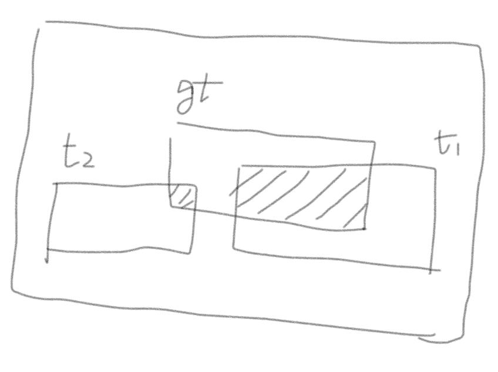
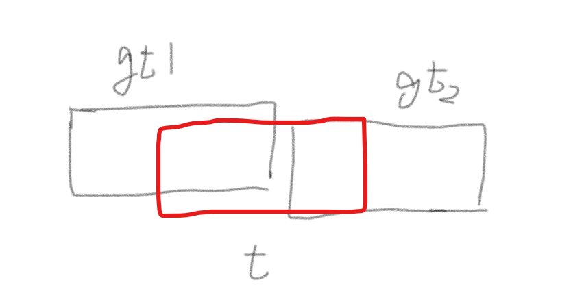

如果是长方形，giou的计算就很简单

```python
def cal_giou(input, target, size_average=True):
    """
    Arguments:
        input (list[Tensor]) n*4
        target (list(BoxList)) the same size with input
        size_average Bool default True need ave or not
    Returns:
        loss tensor 1
    """
    wh_ip = (input[:, 2:] - input[:, :2] + 1).clamp(min=0)
    wh_tg = (target[:, 2:] - target[:, :2] + 1).clamp(min=0)
    area_ip = wh_ip[:, 0] * wh_ip[:, 1]  # N
    area_tg = wh_tg[:, 0] * wh_tg[:, 1]
    lt_in = torch.max(input[:, :2], target[:, :2])  # [N,2]
    rb_in = torch.min(input[:, 2:], target[:, 2:])  # [N,2]
    wh_in = (rb_in - lt_in + 1).clamp(min=0)
    inter = wh_in[:, 0] * wh_in[:, 1]
    lt_ou = torch.min(input[:, :2], target[:, :2])  # [N,2]
    rb_ou = torch.max(input[:, 2:], target[:, 2:])  # [N,2]
    wh_ou = (rb_ou - lt_ou + 1).clamp(min=0)
    outer = wh_ou[:, 0] * wh_ou[:, 1]
    giou = inter / (area_ip + area_tg - inter) - (outer - area_ip - area_tg + inter) / outer
    l_giou = 1 - giou
    if size_average:
        return l_giou.mean()
    return l_giou.sum()
```

> 论文里面提到的是用giou来代替smooth-L1

这里就涉及一个问题，对于负样本我们是否需要用giou loss来指导回归过程的学习

负样本的定义，对于一个proposal，如果他和gt的IoU>0.5，我们就把他的类别设为gt的类别，这样的设计是有意义的，因为如果IoU太小，很难得到原区域的特征

<center></center>

假如$t_1,t_2$都是我们预测出来额proposal，那么对于$t_1$来说它的roi_pooling之后的结果包含了gt区域的信息，我们可以认为他可以正确的去预测出回归的位置。

对于$t_2$而言，由于它基本不包含gt的信息，我们要求他预测出来的是一个负例，那么有没有必要去学习一个回归值呢？

我们从rpn开始出发，对于rpn而言，我们可以产生大量的roi，很多做rpn的工作都给出数据，在数据集上的recall都可以达到很高的水平，但是通过二阶段的分类之后，ap都会低很多。

假设我们已经有了很好的proposal，是否应该选取高质量的proposal进行训练呢，还是要用所有的proposal来进行训练？Region Proposal by Guided Anchoring给出了一个答案，

> We train the Fast R-CNN with different numbers of proposals, and adopt different IoU thresholds to assign labels for foreground/background.
>
> | proposal | num  | IoU thr | AP  |   AP50 | AP75 |
> | -------- | ---- | ---- | ---- | ---- | ---- |
> |     RPN     |    1000| 0.5| 36.7 |58.8 |39.3   |
> ||1000 |0.6| 37.2| 57.1 |40.5|
> ||300| 0.5| 36.1| 57.6 |39.0|
> ||300 |0.6| 37.0| 56.3 |39.5|
> |GA-RPN|1000| 0.5| 37.4 |59.9 |40.0|
> ||1000| 0.6 |38.9 |59.0| 42.4|
> ||300| 0.5 |37.5 |59.6 |40.4|
> ||300| 0.6 |39.4 |59.3 |43.2|

可以看到，训练的时候选取高质量的proposal对结果有着提升的效果

这是不是意味着，对结果影响比较大的部分在于提升检测器的能力，而不是回归的能力


- [x] 实验一：只修改了giou的计算，对于proposal和gt的匹配使用的是iou的匹配，那么对于iou为0会自动匹配第0个gt，计算loss的时候会计算所有的采样结果（包括正例和负例）（错误版本）

> 10000
>
> OrderedDict([('bbox', OrderedDict([('AP', 0.47121527648842015), ('AP50', 0.7594633120518661), ('AP75', 0.5457117143494811), ('APs', 0.33848291026511296), ('APm', 0.5285926546296849), ('APl', 0.5282834660650845)])), ('segm', OrderedDict([('AP', 0.45831975295102784), ('AP50', 0.761267309073844), ('AP75', 0.5235779308929533), ('APs', 0.28100975076509815), ('APm', 0.5254442864691341), ('APl', 0.5962529634728283)]))])
>
> ap: 0.5438, recall: 0.7741, pred: 0.6862, FM: 0.7275
>
> 14000
>
>  OrderedDict([('bbox', OrderedDict([('AP', 0.49631915292267564), ('AP50', 0.7750850369594819), ('AP75', 0.5863941182234097), ('APs', 0.3749694256895278), ('APm', 0.5575629743044395), ('APl', 0.5312646401814272)])), ('segm', OrderedDict([('AP', 0.4740138158025391), ('AP50', 0.7769235866763733), ('AP75', 0.5332837754228076), ('APs', 0.31267169324212263), ('APm', 0.5420152915643027), ('APl', 0.5720775636526061)]))])
>
> ap: 0.5809, recall: 0.8067, pred: 0.7035, FM: 0.7516
>
> ap: 0.5927, recall: 0.7956, pred: 0.7339, FM: 0.7635
>
> ap: 0.6065, recall: 0.7846, pred: 0.7624, FM: 0.7733
>
> 16000
>
> OrderedDict([('bbox', OrderedDict([('AP', 0.4884425763439621), ('AP50', 0.7689431435304503), ('AP75', 0.569089666763469), ('APs', 0.37266140221897043), ('APm', 0.5444734829832455), ('APl', 0.513804383090835)])), ('segm', OrderedDict([('AP', 0.4658158278200459), ('AP50', 0.7642993380035283), ('AP75', 0.5271411082597054), ('APs', 0.310416541760254), ('APm', 0.5329638566322049), ('APl', 0.563598641309607)]))])
>
> ap: 0.6184, recall: 0.7839, pred: 0.7768, FM: 0.7803
>
> ap: 0.6224, recall: 0.7754, pred: 0.7927, FM: 0.7840
>
> 18000
>
> OrderedDict([('bbox', OrderedDict([('AP', 0.4871876561658364), ('AP50', 0.7674319928525674), ('AP75', 0.5706893862591965), ('APs', 0.3740772516746714), ('APm', 0.5453317594761491), ('APl', 0.5162496216288984)])), ('segm', OrderedDict([('AP', 0.46445422340816345), ('AP50', 0.7625447939367843), ('AP75', 0.5291457366248525), ('APs', 0.31420096850076784), ('APm', 0.5266694885257356), ('APl', 0.5664456232808295)]))])
>
> ap: 0.6195, recall: 0.7823, pred: 0.7797, FM: 0.7810
>
> ap: 0.6249, recall: 0.7767, pred: 0.7904, FM: 0.7835

- [x] 实验二：在上面的基础上，修改了proposal和gt的匹配机制，改用giou来匹配，这样的画对于每一个proposal都会有一个最近的gt来和他匹配，对loss也是计算的所有采样结果的loss

> 18000
>
> OrderedDict([('bbox', OrderedDict([('AP', 0.4786553953720044), ('AP50', 0.754947409445157), ('AP75', 0.5467921901256069), ('APs', 0.36129235345000976), ('APm', 0.5295430926593787), ('APl', 0.529036689228749)])), ('segm', OrderedDict([('AP', 0.45441131397573514), ('AP50', 0.7564769663508587), ('AP75', 0.5166193714405706), ('APs', 0.30347822845628597), ('APm', 0.5096910045350396), ('APl', 0.5742175836925845)]))])
>
> ap: 0.7186, recall: 0.7989, pred: 0.7162, FM: 0.7553
> max f-measure threshold: 0.98887
> ap: 0.7186, recall: 0.7689, pred: 0.8126, FM: 0.7902
>
> nms 0.3
>
> OrderedDict([('bbox', OrderedDict([('AP', 0.4690640106085674), ('AP50', 0.7405826975984527), ('AP75', 0.5397300786714194), ('APs', 0.35641114199250595), ('APm', 0.5198902300832551), ('APl', 0.5149370140774654)])), ('segm', OrderedDict([('AP', 0.4480294713561378), ('AP50', 0.7424530330452961), ('AP75', 0.5101416735791279), ('APs', 0.301876813437728), ('APm', 0.5034005966043107), ('APl', 0.5580584030905756)]))])
>
> ap: 0.7037, recall: 0.7859, pred: 0.7782, FM: 0.7820
> max f-measure threshold: 0.98887
> ap: 0.7037, recall: 0.7617, pred: 0.8323, FM: 0.7954
>
> 20000
>
> OrderedDict([('bbox', OrderedDict([('AP', 0.4760577806462798), ('AP50', 0.7528704678185832), ('AP75', 0.54150976241074), ('APs', 0.364778072257973), ('APm', 0.5268806547791756), ('APl', 0.5279970521425383)])), ('segm', OrderedDict([('AP', 0.4504156128712871), ('AP50', 0.7464682011956341), ('AP75', 0.505968425076812), ('APs', 0.30305888841889034), ('APm', 0.5032539482646401), ('APl', 0.5763211366755265)]))])
>
> ap: 0.7160, recall: 0.7982, pred: 0.7239, FM: 0.7593
> max f-measure threshold: 0.99926
> ap: 0.7160, recall: 0.7432, pred: 0.8460, FM: 0.7913

- [x] 实验三：这里只是简单的调整了loss的计算准则，使用了和smooth-L1同样的计算方式，即只计算正样本的loss，那么这样的话，绝大多数情况下匹配机制没有影响（影响只发生在giou最大值和iou最大值发生在不同gt上面，如下图，两种iou相同时，giou可以不同）

<center>
    
</center>

> 6000
>
> OrderedDict([('bbox', OrderedDict([('AP', 0.4993052940108992), ('AP50', 0.8049444446805232), ('AP75', 0.5669744714041547), ('APs', 0.4098970836750055), ('APm', 0.5441658669406793), ('APl', 0.5263938215232845)])), ('segm', OrderedDict([('AP', 0.477631079611562), ('AP50', 0.7931975039496515), ('AP75', 0.539144129659787), ('APs', 0.3367295197195805), ('APm', 0.5290558751552782), ('APl', 0.5730472221885231)]))])
>
> ap: 0.7247, recall: 0.8253, pred: 0.5738, FM: 0.6769
> max f-measure threshold: 0.92176
> ap: 0.7247, recall: 0.7311, pred: 0.7826, FM: 0.7560
>
> 8000
>
> OrderedDict([('bbox', OrderedDict([('AP', 0.5058735553182421), ('AP50', 0.7924615821770049), ('AP75', 0.5852161242205217), ('APs', 0.39217762904649867), ('APm', 0.5595223974189256), ('APl', 0.5487540860239546)])), ('segm', OrderedDict([('AP', 0.4735358238353078), ('AP50', 0.7893381133383967), ('AP75', 0.5272644313198389), ('APs', 0.320418609626653), ('APm', 0.535185839731485), ('APl', 0.589060282878651)]))])
>
> ap: 0.7244, recall: 0.8025, pred: 0.7157, FM: 0.7566
> max f-measure threshold: 0.86978
> ap: 0.7244, recall: 0.7604, pred: 0.8070, FM: 0.7830
>
> 11000
>
> OrderedDict([('bbox', OrderedDict([('AP', 0.49434046016810346), ('AP50', 0.7726662434633201), ('AP75', 0.5765010461401184), ('APs', 0.38385377262764886), ('APm', 0.5421221234161975), ('APl', 0.5506641635643872)])), ('segm', OrderedDict([('AP', 0.4630758053573371), ('AP50', 0.7658931611975266), ('AP75', 0.5244547673570796), ('APs', 0.31283498316839975), ('APm', 0.5190373147131911), ('APl', 0.5910065932617301)]))])
>
> ap: 0.7060, recall: 0.7963, pred: 0.7150, FM: 0.7534
> max f-measure threshold: 0.72831
> ap: 0.7060, recall: 0.7771, pred: 0.7661, FM: 0.7715
>
> 12000
>
> OrderedDict([('bbox', OrderedDict([('AP', 0.49722951893486145), ('AP50', 0.7806443127451892), ('AP75', 0.5767483318256041), ('APs', 0.3708550595378972), ('APm', 0.5562132079147023), ('APl', 0.5494784492168505)])), ('segm', OrderedDict([('AP', 0.47537944677682364), ('AP50', 0.7766425067390392), ('AP75', 0.5509388574990385), ('APs', 0.31114106985326223), ('APm', 0.5367839451607245), ('APl', 0.5882367349420504)]))])
>
> ap: 0.7258, recall: 0.8041, pred: 0.7216, FM: 0.7606
> max f-measure threshold: 0.95262
> ap: 0.7258, recall: 0.7353, pred: 0.8261, FM: 0.7781
>
> 14000
>
> OrderedDict([('bbox', OrderedDict([('AP', 0.5090965420382423), ('AP50', 0.779634529628291), ('AP75', 0.5869569934665309), ('APs', 0.3956032186276403), ('APm', 0.5620577221131229), ('APl', 0.5607092377061906)])), ('segm', OrderedDict([('AP', 0.48012041070919353), ('AP50', 0.7824398514480823), ('AP75', 0.5473537810671086), ('APs', 0.32422932329170356), ('APm', 0.5415907948735369), ('APl', 0.5914574757937309)]))])
>
> ap: 0.7470, recall: 0.8149, pred: 0.7174, FM: 0.7630
> max f-measure threshold: 0.98883
> ap: 0.7470, recall: 0.7604, pred: 0.8223, FM: 0.7902
>
> 16000
>
> OrderedDict([('bbox', OrderedDict([('AP', 0.508418657948124), ('AP50', 0.779723403143535), ('AP75', 0.5922983605603168), ('APs', 0.39041689599894697), ('APm', 0.5661244455426658), ('APl', 0.5464666444634316)])), ('segm', OrderedDict([('AP', 0.4774390282676843), ('AP50', 0.7742362714098522), ('AP75', 0.5437234139956103), ('APs', 0.3172753664200275), ('APm', 0.5430229386478479), ('APl', 0.5839911306051909)]))])
>
> ap: 0.7369, recall: 0.8110, pred: 0.7233, FM: 0.7646
> max f-measure threshold: 0.99348
> ap: 0.7369, recall: 0.7637, pred: 0.8224, FM: 0.7920
>
> 18000
>
> OrderedDict([('bbox', OrderedDict([('AP', 0.5033120269695318), ('AP50', 0.7782682698109237), ('AP75', 0.5794012989894555), ('APs', 0.38469429331915234), ('APm', 0.558696830991325), ('APl', 0.545578263162207)])), ('segm', OrderedDict([('AP', 0.47393289824506), ('AP50', 0.7738023494827369), ('AP75', 0.532150213081911), ('APs', 0.3170156130009327), ('APm', 0.5373010569061161), ('APl', 0.581825870425836)]))])
>
> ap: 0.7360, recall: 0.8126, pred: 0.7289, FM: 0.7685
> max f-measure threshold: 0.99507
> ap: 0.7360, recall: 0.7637, pred: 0.8238, FM: 0.7926
>
> 20000
>
> OrderedDict([('bbox', OrderedDict([('AP', 0.5032353469755415), ('AP50', 0.7707885420737491), ('AP75', 0.5821837866143157), ('APs', 0.3877970852931854), ('APm', 0.5600518887561257), ('APl', 0.5368519195640311)])), ('segm', OrderedDict([('AP', 0.47222319627644077), ('AP50', 0.7733172656225962), ('AP75', 0.5296582998568262), ('APs', 0.3154834619323624), ('APm', 0.5386364407123982), ('APl', 0.5741991862520655)]))])
>
> ap: 0.7264, recall: 0.8142, pred: 0.7193, FM: 0.7638
> max f-measure threshold: 0.9967
> ap: 0.7264, recall: 0.7637, pred: 0.8221, FM: 0.7918

上面的结果可以看到，并没有什么明显的区别，所以在训练集上面做了相同条件下的对比实验

训练集上实验

实验二

nms 0.3 train

OrderedDict([('bbox', OrderedDict([('AP', 0.8449020506491403), ('AP50', 0.9701685142420305), ('AP75', 0.9599626918392586), ('APs', 0.7953725082950523), ('APm', 0.8480390746461448), ('APl', 0.8583951662505912)])), ('segm', OrderedDict([('AP', 0.7876871150913503), ('AP50', 0.9693821257085898), ('AP75', 0.9466632676499002), ('APs', 0.7043563780370854), ('APm', 0.7861713970999742), ('APl', 0.8065992435868327)]))])

实验三

nms 0.3 train

OrderedDict([('bbox', OrderedDict([('AP', 0.9075780162209746), ('AP50', 0.980100724533506), ('AP75', 0.9700319352705218), ('APs', 0.8736396478248291), ('APm', 0.9112538549057198), ('APl', 0.9148189702102989)])), ('segm', OrderedDict([('AP', 0.8224591102028196), ('AP50', 0.9695614438074178), ('AP75', 0.9582706288836318), ('APs', 0.7454222833770783), ('APm', 0.8249437156476407), ('APl', 0.8417473695598956)]))])

可以看到，在相同的实验条件（迭代次数、aspect-ratio等）下，只计算有效的giou可以明显的增加拟合的程度

不过上面的实验结果并不能说明什么，因此准备在一个更加复杂的曲线数据集上进行实验。