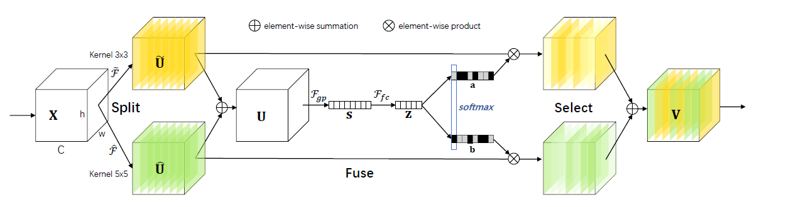

## [Selective Kernel Networks](https://arxiv.org/pdf/1903.06586.pdf)

这一系列的论文结构都并不复杂，里面蕴含的思想也很简单，不过效果还是挺好的

起码resnext是经过公认的，其他的还不知道。

#### 首先是对resnext的介绍

    

上面这个图可以看出resnext在resnet上面的改进，整个结构在大体上没有改变，保留了resblock的基本结构，即降维特征提取然后提高维度再加上skip-feature，这样能够在很大程度上节省计算的开支。resnext最大的贡献在于提出了一个叫做cardinality的概念，可以看到这里利用了分组卷积的概念，当channel数很大的时候，参数的数量会变得很多，使用分组卷积可以在很大程度上减少参数，可以看到，这种操作在保留相同参数数量的时候（约70k）可以保留更多的特征，减少降维的影响。

作者在论文里面也提到了 ResNeXt && Inception-ResNet && Grouped Convolutions 是可以等价的

    

