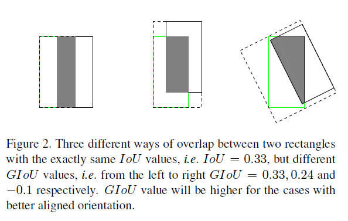

## [Generalized Intersection over Union: A Metric and A Loss for Bounding Box Regression](https://arxiv.org/pdf/1902.09630.pdf)

IoU是一个很常见的评估度量，然而我们在做检测的时候预测的往往不是直接的IoU，而是去预测bbox的坐标

然而IoU并不是那么好直接作为预测目标，对于匹配的anchor，IoU是可以计算的，但是对于与gt不相交的bbox，IoU为0，优化无法继续

本篇文章不是第一个优化IoU的

> **an approximate function** Optimizing intersection-overunion in deep neural networks for image segmentation.
>
> **a surrogate loss** The lovaszsoftmax loss: A tractable surrogate for the optimization of the intersection-over-union measure in neural networks.
>
> Acquisition of localization confidence for accurate object detection
>
> Unitbox: An advanced object detection network.

上面提到了IoU的第一个问题，这个问题也不是没有办法解决的，因为loss为0不会影响其他loss的收敛，只要回归的loss能够继续收敛，就不会出现IoU-loss始终为0的情况

第二个问题是作者提出来的一个关键问题

IoU无法正确区分两个对象的不同对齐方式。这种情况可以见下图

作者这种想法是很有道理的，因为虽然上面这几种情况IoU是一样大的但是明显前两种种情况对于我们来说是更有利的。

GIoU的定义很简单，就是先计算两个框的最小闭包区域面积，再计算IoU，再计算闭包区域中不属于两个框的区域占闭包区域的比重，最后用IoU减去这个比重得到GIoU。
$$
IoU=\frac{|A\cap B|}{|A\cup B|}\\
GIoU=IoU-\frac{|C\backslash (A\cup B)|}{|C|}
$$

- 与IoU相似，GIoU也是一种距离度量，作为损失函数的话，$\mathcal{L}_{GIoU}=1-GIoU$，满足损失函数的基本要求
- GIoU对scale不敏感
- GIoU是IoU的下界，在两个框无线重合的情况下，IoU=GIoU
- IoU取值[0,1]，但GIoU有对称区间，取值范围[-1,1]。在两者重合的时候取最大值1，在两者无交集且无限远的时候取最小值-1，因此GIoU是一个非常好的距离度量指标。
- 与IoU只关注重叠区域不同，GIoU不仅关注重叠区域，还关注其他的非重合区域，能更好的反映两者的重合度。

可以看到的是，这种改进对于loss来说是非常好的避免了无法匹配时候IoU无法训练的情况，使得IoU的训练可以独立出来

|                        |          |
| ---------------------- | -------- |
| plateau                | 停滞期   |
| metric                 | 度量     |
| address the weaknesses | 解决弱点 |

