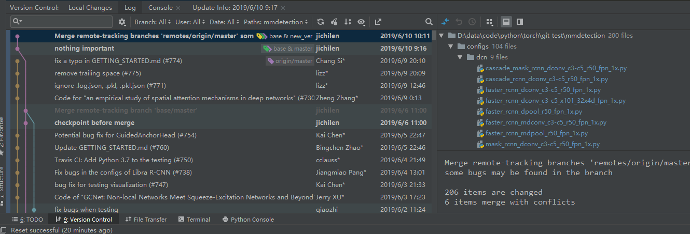

```
layout: post
title:  "git and git in pycharm"
date:   2019-3-4
desc: "something about git"
keywords: "git"
categories: [PYTHON]
tags: [python,coding,learning,git]
icon: icon-html
```

git在使用的时候非常的方便

当一个项目需要多个人进行维护的时候，使用git可以极大的提高我们的效率

本人常用的git有两种，一种是pycharm自带的git，一种是控制台git，两种git在本质上没有区别，只是pycharm自带了git的可视化，用起来非常的方便。

## 控制台git

#### git init

初始化一个git

#### git add & git rm

增加文件，`git add .`是比较常用的方式，不过很多时候有些文件不需要添加，需要使用`git add folder/*`的模式来进行添加，没有比较好的参数如`--exclude = *.jpg`

`git rm --cached`是常用的删除方式

#### git remote

查看远程仓库，最常使用的为新建远程仓库`git remote add [-t <branch>] [-m <master>] [-f] [--[no-]tags] [--mirror=<fetch|push>] <name> <url>`

#### git mv

git使用过程中要严格的避免mv，如果要移动文件使用`git mv`

#### git branch && git checkout

在进行多分支维护的时候，我们需要知道我们位于哪一个分支

新建分支`git branch name`

#### git log && git show

我们在维护的时候难免会遗忘之前做的修改，并且多人维护的时候我们希望知道别人在commit的时候进行了怎样的修改，这个时候git show commitID就可以帮助我们

#### git reset && git reflog

我们在进行维护的时候难免会增加新的bug，而当这个bug是一个致命的修改，并且他和我们的源代码是高度耦合的，这对于没有使用git管理的项目来说基本是一个噩梦，我们需要经常备份我们的代码，或者是使用更加合理的结构设计来避免我们的代码耦合、

不过如果我们有一个使用git的好习惯，这一切对于我们来说是很简单的事情。

对于一个新的功能，我们可以先做一个心理预期，对于复杂程度很高、对源代码有很大破坏的新模块，我们完全没有必要再master进行更新，这样反而会影响其他人对其进行维护

退一步说，就算我们在master进行了破坏，我们也可以使用`reset --hard commitID`的模式来恢复我们修改之前的代码

如果我们一不小心使用了`git reset`退回到了错误的版本，`git reflog`可以帮助我们找到`git log`中已经被删除的未来版本的信息。

> 上面的事实告诉我们，即使我们使用了`git reset`，`git rm`等操作，我们的历史记录依旧会保存在git中，如果我们不小心在git中加入了一个大文件，这对于我们的项目拉取来说是很烦的，简单的做法我们可以考虑删除git的历史记录，当然如果不希望删除git的历史记录，就需要[!更加复杂的操作](https://www.cnblogs.com/langzou/p/9877165.html)来减小`.git`项目的体积

#### git cherry-pick

这个指令在小的项目开发中基本用不到，不过依旧可以使用它来进行一些有意义的操作

cherry-pick的本质是从一个分支接受另外一个分支的commit，最常见的例子存在于稳定版与开发板的并行开发中，由于他们的系统版本是不同的，完全merge一个分支的做法是错误的，但是如果开发版中有一个功能趋于稳定，我们希望将它运用到稳定版中，这个时候cherry-pick就可以发挥它强大的功能了。

> 值得注意的是，cherry-pick虽然有着非常强大的功能，他也对我们的commit有着非常严格的要求，如果我们错误地将两个功能写入一个commit，或者是非常多个commit来修改一个功能，这个时候会给我们带来非常大的工作量。其次，对我们的功能封装也带来了很高的要求，我们必须是的功能完全模块化，如果在一个模块里面包含了我们不希望的功能，或者是我们在一个模块中引入了其他模块的某个功能，这对于一个好的cherry-pick也是一个问题。

## 控制台git的弊端

首先控制台git需要我们对git的指令非常的熟悉，最少上面的指令是我们需要经常使用的。

其次由于git存在着大量的信息，我们需要用很多重复的指令来确定我们的位置，以保证我们进行正确的commit（当然zshell+osh可以减少一些重复的工作量）。

## 借助pycharm强大的可视化功能进行管理



#### 开启version control

file -> settings  search 'version control'

使用git来托管当前的项目，如果没有初始化git，需要进行初始化

#### 可视化

上面一个图基本可以说明所有的问题，我们在进行大项目维护的时候，如果依旧使用控制台`git log && git show`是非常痛苦的

上面的图是一个多remote 多branch 多人维护的一个项目，使用version control我们可以很方便的知道提交该commit的人以及时间，当前分支的HEAD的位置，当前提交的分支修改的文件以及文件修改的内容，这样我们可以对这个项目的变化有一个非常清晰的脉络