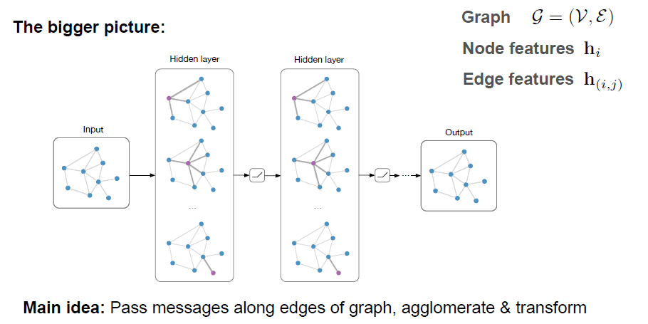
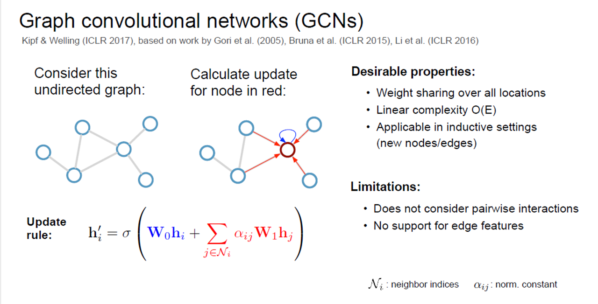

```
layout: post
title:  "SEMI-SUPERVISED CLASSIFICATION WITH GRAPH CONVOLUTIONAL NETWORKS"
date:   2019-6-12
desc: "SEMI-SUPERVISED CLASSIFICATION WITH GRAPH CONVOLUTIONAL NETWORKS"
keywords: "python"
categories: [Html]
tags: [reading,object,points]
icon: icon-html
```

## [SEMI-SUPERVISED CLASSIFICATION WITH GRAPH CONVOLUTIONAL NETWORKS](https://arxiv.org/pdf/1609.02907.pdf)

这篇文章在图数据上进行了半监督的学习，

还童的拉普拉斯归一化loss如下

$ℒ=ℒ_0+λℒ_{reg},with  ℒ_{reg}=∑_{i,j}S_{ij} ‖f(X_i )-f(X_j)‖^2=f(X)^T Δf(X) ​$

但是这种模式是建立在连接的节点具有相同的标签的假设下的

这篇文章直接使用神经网络模型$f(X,A)$来训练$ℒ_0$

#### 图卷积网络

首先作者提出了前向传播的公式
$$
H^{(l+1)}=\sigma(\tilde D^{-\frac{1}{2}}\tilde A\tilde D^{-\frac{1}{2}}H^{(l)}W^{(l)})
$$

不考虑平滑因子$\tilde D^{-\frac{1}{2}}\tilde A\tilde D^{-\frac{1}{2}}$,$H^{(l+1)}=\sigma(H^{(l)}W^{(l)})$

$\tilde A=A+I_N $

$\tilde D_ii=\sum_j\tilde A_{ij}​$

具体的见图


后面是一系列的推导，其实这个推导的意义并不是很大，我认为作者是先想到了最终的表达模式，然后才想到的从谱图傅里叶进行推导。
$$
H^{(l+1)}=\sigma(\tilde D^{-\frac{1}{2}}\tilde A\tilde D^{-\frac{1}{2}}H^{(l)}W^{(l)})
$$
上式有一个非常好的可视化的图：



可以很有意义的说明这个图。