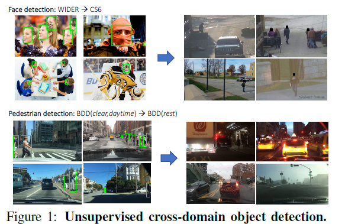
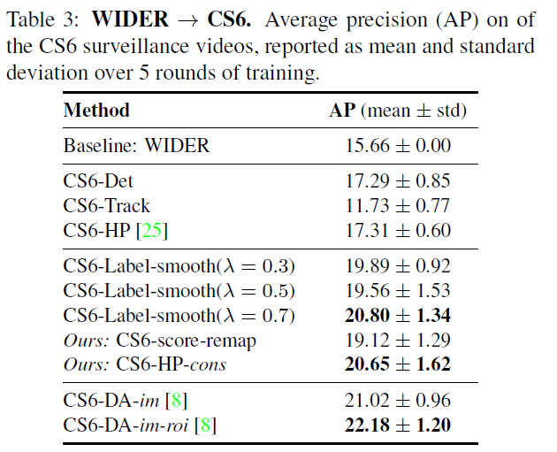

```
layout: post
title:  "Automatic adaptation of object detectors to new domains using self-training"
date:   2019-6-12
desc: "Automatic adaptation of object detectors to new domains using self-training"
keywords: "python"
categories: [Html]
tags: [reading,object,points]
icon: icon-html
```

## Automatic adaptation of object detectors to new domains using self-training

对于深度学习的方法而言，跨域(cross_domain)一直都是一个非常困扰大家的问题，明明我有好的效果，但是我只能针对我训练过的特殊情况，而传统方法往往有着很好的泛化性能。

为了解决上述的问题，已经有了很多尝试

- 使用大数据集进行预训练，imagenet
- 迁移学习
- 使用对抗领域判别器来学习域不变特征
- 使用gan来生成新的域的数据

可以看到，上述的方法都需要使用额外的数据。但是有一个趋势是使用更少的数据来进行网络的迁移过程。

有很多人都提出了自训练的方式，首先生成“pseudo-labeled samples”，然后使用这些数据进行重新训练。不过这种模式有很多的困难，首先是pseudo-labeled会带来很多的噪声，由于检测器性能的限制，误报和漏报在所难免，第二个问题是这些错误的检测会成为难样本，因为他和我们的训练目标相反，会使得我们的模型往坏的方向训练。

这种方式可以认为是跨域的无监督学习。



#### 作者提出了两个贡献

第一个是利用了视频中时间上的连续性进行了无监督的跨域学习

第二个是设计了一个基于知识蒸馏的loss来解决跨域的困难。

#### 方法的主要流程

视频自动标注，这个很好理解，首先在视频每一帧跑faster rcnn，然后利用视频跟踪的方法来检测tracklet，tracklet就是一个目标跟踪的轨迹。这里面的方法很重要，然而作者引用了自己之前的一篇工作，然后里面又引用了**distribution field tracker**

> 暂时不知道这个方法和cv2里面的模板匹配有啥关系，只知道之前工作开源的部分给出了这个模板匹配的算法，由于开源不全，也不清楚是否就是论文里面提到的方法。

使用pseudo-labele进行训练，这里作者先设定所有label的权重为1，包括pseudo以及gt

