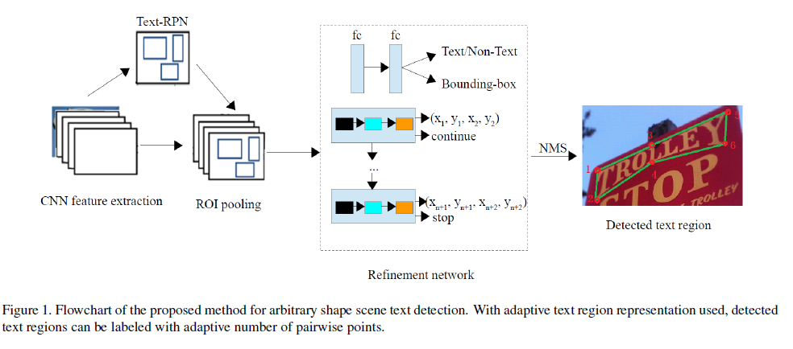

```
layout: post
title:  "Arbitrary Shape Scene Text Detection with Adaptive Text Region Representation"
date:   2019-7-1
desc: "Arbitrary Shape Scene Text Detection with Adaptive Text Region Representation"
keywords: "python"
categories: [Html]
tags: [reading,object,points]
icon: icon-html
```

## Arbitrary Shape Scene Text Detection with Adaptive Text Region Representation

这篇文章是三星19年的cvpr

主要的目标是做曲线文本的检测任务

这篇文章的主要贡献是提出了一种自适应的曲线文本区域的表示方法。

使用循环神经网络来进行区域修正，在这个过程中，每一个时间步骤都产生一对边界点直到没有点产生

类似工作：CTD（14点表示polygon），text-snake（中心线和span表示区域），mask-text spotter(在box里面做语义分割来找字符)

问题：用固定的点数来表示文字并不合适，后两个都需要计算每个像素的值，使得的计算变得很复杂



检测器依旧是一个二阶段的检测器，个人感觉灵感应该来自于mask rcnn关键点检测的分支。

### 自适应文本区域表示

要用点来描述文本区域，最重要的是点具有严格的位置关系或者语义关系，比如两个角点，两个重点，否则的话网络的输出不知道该通道对应的是哪个位置的点，这对于学习过程是致命的，正因为这个问题，四边形预测的时候也会遇到一些困难，详情见(Omnidirectional Scene Text Detection with Sequential-free Box Discretization)，这篇论文提出并解决了这个问题。

其次，这个点的生成必须是不需要额外信息的，不然就和字符标注没有区别，最终的效果也不一定会有字符标注的效果好。

考虑到文本区域通常具有近似对称的上下边界，提出了这种使用关键点对来描述的方式（这种方式来自于text snake，虽然文中没有说，但是text snack开源的代码里面都有类似的功能了）

不过这种描述依旧存在问题：
$$
\square \square \square\square \blacksquare \blacksquare\square \square \square\blacksquare \square \square\square \\
\square\square \square\square \blacksquare \square\square \square \square\blacksquare \square \square\square \\
\square\square\square\blacksquare \square \square\square \square \square\blacksquare \square \square\square \\
\square\square \blacksquare \blacksquare \square\square\square \square \square\blacksquare \square \square\square \\
\square \blacksquare\blacksquare \square \square\square\square \square \square\blacksquare \square \square\square \\
$$
很明显作者并没有完全解决表示的歧义问题。不过这也是多边形描述的通病。

### 文本候选区域

backbone是一个SE-VGG16，SE-block显式的对通道之间的关系进行建模。

| Layer                      | Kernel                                                 |
| :------------------------: | :----------------------------------------------------: |
| </r>Conv1<br></r>Pool1<br>SE1 | </r>[3 x 3; 64] x 2<br/></r>2 x 2, stride 2<br/>4, 64 |
| </r>Conv2<br/></r>Pool2<br/>SE2 | </r>[3 x 3; 128] x 2<br/></r>2 x 2, stride 2<br/>8, 128 |
| </r>Conv3<br/></r>Pool3<br/>SE3 | </r>[3 x 3; 256] x 3<br/></r>2 x 2, stride 2<br/>16, 256 |
| </r>Conv4 <br/></r>Pool4 <br />SE4 | </r>[3 x 3; 512] x 3<br/></r>2 x 2, stride 2<br/>SE4 32, 512 |
| </r>Conv5 <br/></r>Pool5 <br/>SE5 | </r>3 x 3; 512] x 3<br/></r>2 x 2, stride 2<br/>32, 512 |

### proposal矫正

这一部分本质上来说是一个回归矫正的过程。

可以认为是一个迭代过程，不过这里用RNN实现的，因为预先不知道解码的长度，这个和通用的做法是一致的。识别方法中利用attention生成识别序列的方法就采用的是这个思路。

网络的输入是一roipooling的结果可以认为是$[num\_rios \times c \times w \times h]$

在LSTM的每个时间步长中都有两个分支，分别负责回归和分类。

然后会经过一个polygon nms，这个polygon nms比较关键，然而并没有说怎么做的

> 其实到这里会有一个很明显的疑问，我怎么知道这个rnn什么时候停止，标注的时候应该标注多少对点，
>
> 这个问题不类似其他的序列问题。我知道标注的时候需要标注一个多长的序列，在这里生成标注的时候，不知道点的数量，就会带来标注的歧义。影响网络训练的效果
>
> 如果我预测的时候只会预测出2对点该怎么办

### 具体实现

这里作者给出了处理ctw1500和total的方法，大致能够赋予标注信息一些意义

> Then, we compute the intersection angle for each point, which is the angle of the two vectors from current point to its nearby two points.And for each point pair, the angle is the smaller one of the two points. Next, point pairs are sorted according to their angles in descending order and we try to remove each point pair in the order. If the ratio of the polygon areas after removing operation to the original area is larger than 0.93, this point pair can be removed. Otherwise, the operation stops and the remaining points are used in the training for text region representation.

具体的数值都不高，可能因为backbone不够强，也有可能就是歧义问题带来了很大的影响。