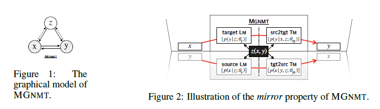

# MIRROR-GENERATIVE NEURAL MACHINE TRANSLATION(ICLR 满分论文)

**[Zaixiang Zheng](https://openreview.net/profile?email=zhengzx.142857%40gmail.com)*,* [Hao Zhou](https://openreview.net/profile?email=zhouhao.nlp%40bytedance.com)*,* [Shujian Huang](https://openreview.net/profile?email=huangsj%40nju.edu.cn)*,* [Lei Li](https://openreview.net/profile?email=lilei.02%40bytedance.com)*,* [Xin-Yu Dai](https://openreview.net/profile?email=daixinyu%40nju.edu.cn)*,* [Jiajun Chen](https://openreview.net/profile?email=chenjj%40nju.edu.cn)**

**机构：**南京大学，字节跳动

### Introduction

> 背景知识：
>
> 平行/对应语料库（parallel corpora）是由原文文本及其平行对应的译语文本构成的双语/多语语料库，其对齐程度可有词级、句级、段级和篇级几种。平行语料库按翻译方向的不同有单向平行语料库（uni-directional parallel corpora）、双向平行语料库（bi-directional parallel corpora） 和多向平行语料库（multidirectional parallel corpora）等三种形式。
>
> 对比/类比语料库（comparable corpora）是由不同语言的文本或同一种语言不同变体的文本所构成的两个或两个以上的语料库。 类比语料库也可再细分出单语类比库和双语/多语类比库。前者收集一种语言类似环境下的类似内容的文本，如Loviosa构建的ECC（English Comparable Corpus, TEC的姊妹项目）属于此种。而后者收集的是在内容、语域、交际环境等方面相近的不同语言文本，多用于对比语言学

#### **动机**：

常规的神经机器翻译(NMT)需要大量平行语料，而**平行预料难以获得**。原始的非平行语料极易获得，但是现有基于非平行语料的方法仍旧有提升的空间。

为此，本文提出一种**镜像生成式机器翻译模型**：MGNMT(mirror-generative NMT)。该框架同时集成了source-target和target-source的翻译模型及其各自语种的语言模型。MGNMT中的翻译模型和语言模型**共享隐语义空间**，所以能够从非平行语料中更有效地学习两个方向上的翻译。此外，翻译模型和语言模型还能够**联合解码**，提升翻译质量。

> 如何共享语义？
>
> 如何联合解码？

#### 现有方法的问题：

当下的NMT系统在研究非平行语料时，一般是用回译法(back-translation )。"back-translation **individually** updates the two directions of machine translation models"，这显得不够高效。"Namely, each updating of $T_{My\rightarrow x}$ will not directly benefit $T_{Mx\rightarrow y}$."  $T_M​$这里指的是src2tgt translation model。对此，有学者提出联合回译法和对偶学习(dual learning)，在迭代训练中使二者隐含地相互受益。"But translation models in these approaches are **still independent**."。理想状态下，当两个方向的翻译模型相关，则**非平行语料所带来的增益能够进一步提高**。此时，一方每一步的更新都能够提升另一方的性能，反之亦然。这将更大地发挥非平行语料的效用。

> 什么是back-translation：有了目标语言句子y, 用训练好的目标语言到源语言的翻译模型得到伪句对(x’, y), 加入到平行句对中一起训练. 

对于解码，有学者提出在翻译模型$T_{Mx\rightarrow y}$ 中直接插入独自在target语种上训练的外部语言模型$L_{My}$。有效但是作者认为不够好：$L_{My}$来自于外部，**独立**，**无法良好协作，甚至带来冲突**；$L_{My}$仅在解码中使用，而训练过程没有。这导致**训练和解码不一致**，可能会影响性能。

> 总的来说作者就之前的方法找了两个比较不足的点：back-translation两个翻译器没有直接的交互，解码过程的语言模型不可训练提出了新的结局思路。感觉两个方法其实都有很大的借鉴意义。
>
> 第一：Cycle GAN，包括这篇其实是为了解决不同域之间数据缺乏现象的一类代表，现在我们面临越来越多这种问题，包括文字最近的GA-DAN其实也是这个思路。如何有效的在循环，或者这种对称模式加加入更多更有效的交互对于我们值得思考。
>
> 第二：直接插入语言模型现在可太常见了，以zeroshot为代表的很多无监督方法，都直接引入语言模型。很明显这些语言模型能否混合训练对于我们cv届其实是一个更难得问题，视觉特征不应该直接对其语义特征，而是我们应该联合训练两个模型。

#### 贡献：

本文提出镜像生成式NMT(MGNMT)尝试解决上述问题，进而更高效地利用非平行语料。MGNMT在一个统一的框架中联合翻译模型(两个方向)和语言模型(两个语种)。受生成式NMT(GNMT)的启发，MGNMT中引入一个在x和y之间共享的隐语义变量z。本文利用对称性或者说镜像性质来分解条件联合概率p(x, y | z)：
$$
\log p(x, y | z)=\log p(x | z)+\log p(y | x, z)=\log p(y | z)+\log p(x | y, z)\\
=\frac{1}{2}\left[\underbrace{\log p(y | x, z)}_{\text {src2tgt} T_{Mx\rightarrow y } }+\underbrace{\log p(y | z)}_{\text {target } L_{My}}+\underbrace{\log p(x | y, z)}_{\text {tga2src} T_{My\rightarrow x}}+\underbrace{\log p(x | z)}_{\text{source } L _{Mx}}\right] \;\;\;\; (1)
$$
MGNMT的概率图模型如Figure 1所示：

> 图一说明了有p(x|z),p(y|z),p(x|y),p(y|x)，z是一个隐变量

通过共享的隐语义变量将两个语种的双向翻译模型和语言模型分别对齐，如Figure 2所示：

引入隐变量后，将各个模型关联起来，且在给定z下条件独立。如此的MGNMT有如下2个优势：

(1)训练时，由于隐变量的作用，两个方向的翻译模型不再各自独立，而是相互关联。因此一个方向上的更新直接有益于另一个方向的翻译模型。这提升了非平行语料的利用效率；

(2)解码时，MGNMT能够天然地利用其内部target端的语言模型。这个语言模型是与翻译模型联合学习的，联合语言模型和翻译模型有助于获得更好的生成结果。

> 看了图二，一脸懵逼，唯一个感觉是真的像Cycle GAN那种类型的图。隐变量z在这里起了至关重要的作用，从公式和图2都能反映出来，也顺便回答了我们上面提出的两个问题。那么z到底是如何工作的呢？

### BACKGROUND AND RELATED WORK

神经机器翻译：传统的NMT通常是用encoder-decoder来进行判别式学习，学习目标是$logp(y|x;\theta_{xy})$

近些年，有方法提出了语言xy之间存在共享的语义z，它被NMT隐式的学习。GNMT则用联合概率（生成模型）来代替判别模型。

上面这两种方法都是平行语料的，对于非平行预料，back-translation和对偶学习是常见的方法，不过效果没有MGNMT好

一些其他的方法通过贡献参数和词汇表来处理非平行语料，不过无法处理差异大的语言对（中英）

和GNMT区别：尽管GNMT包含一个源端语言模型，但它不能帮助解码。相比之下，MGNMT很可能会联合学习翻译和语言建模，并且可以自然地将两者结合在一起以获得更好的一代。

> 可以看到，该工作室GNMT的一个改进，主要的区别在于针对非平行语料镜像结构，以及联合学习的语言模型，也正是上面提到的两点，对于其他的方法，作者没有给出太多理论上的分析，主要是靠实验来说明的。

### MIRROR-GENERATIVE NEURAL MACHINE TRANSLATION

MGNMT的整体框架如Figure 3所示：

MGNMT对双语句对进行联合建模，具体是利用联合概率的镜像性质：
$$
\log p(x, y | z)=\frac{1}{2}[\log p(y | x, z)+\log p(y | z)+\log p(x | y, z)+\log p(x | z)]
$$
其中隐变量z(**本文选用标准高斯分布**)表示x和y之间的语义共享。隐变量桥接了两个方向的翻译模型和语言模型。下面分别介绍平行语料和非平行语料的训练及其解码。

> 这个图的解释很少，基本上只给出了一个简单的公式以及对z的说明。公式的推导见公式1，可以看到，隐变量z在这里是桥梁，右边是我们希望优化的模型与z的关系，左边是我们对z的求解过程？

**平行语料的训练**

给定平行语料对(x,y)，使用随机梯度变分贝叶斯法(stochastic gradient variational Bayes，SGVB)得到$log p(x,y)$的近似最大似然估计。近似后验可以参数化为：
$$
q(z | x, y ; \phi)=\mathcal{N}\left(\boldsymbol{\mu}_{\phi}(x, y), \boldsymbol{\Sigma}_{\phi}(x, y)\right)
$$
从方程(1)中可以得出联合概率对数似然的证据下界(Evidence Lower BOund，ELBO)：
$$
\log p(x, y) \geq \mathcal{L}(x, y ; \boldsymbol{\theta}, \phi)=\mathbb{E}_{q(z | x, y ; \phi)}[\frac{1}{2}\left\{\log p\left(y | x, z ; \theta_{\mathrm{xy}}\right)+\log p\left(y | z ; \theta_{\mathrm{y}}\right)\\
+\log p\left(x | y, z ; \theta_{\mathrm{yx}}\right)
+\log p\left(x | z ; \theta_{\mathrm{x}}\right)\right\}]\\
-D_{\mathrm{KL}}[q(z | x, y ; \phi) \| p(z)]    \;\;\;\; (2)
$$
方程(2)中第一项表示句子对log似然的期望，该期望用蒙特卡洛采样获得。第二项是隐变量的近似后验和先验分布之间的KL散度。通过重新参数化的技巧，使用基于梯度的算法联合训练所有部分。

> 这里是一个近似优化的思想，首先将隐变量z近似成一个高斯，然后利用KL散度来衡量两个概率分布之间的差异。由于z的近似，所以极大似然估计和真实分布之间的差距就是一个KL散度$\log p(x, y) = \mathcal{L}(x, y ; \boldsymbol{\theta}, \phi)+D_{\mathrm{KL}}[q(z | x, y ; \phi) \| p(z)]  $，估计这么写就高端大气一点吧。

**非平行语料的训练**

本文在MGNMT中设计一种迭代训练方法以利用非平行语料。在该训练过程中两个方向的翻译都能够受益于各自的单语种数据集，且能够相互促进。非平行语料上的训练方法如 Algorithm 1所示：

其中(x,y)表示source-target语言对，*θ*表示模型参数，$D_{xy} $表示平行语料，$D_x$和$D_y$分别表示各自的非平行单语语料。

给定两个非平行句子：source语种中的句子$x^s$和target语种中的句子$y^t​$。目标是使它们的边际分布似然的下界相互最大化：
$$
\log p\left(x^{(s)}\right)+\log p\left(y^{(t)}\right) \geq \mathcal{L}\left(x^{(s)} ; \theta_{x}, \theta_{y x}, \phi\right)+\mathcal{L}\left(y^{(t)} ; \theta_{y}, \theta_{x y}, \phi\right)  \;\;\;\;\;(3)
$$
其中小于等于号右边的两项分别表示source和target的边际对数似然的下界。

以上述第二项为例。用$p(x|y^t)$在source语种中采样出的x作为$y^t$的翻译结果(即回译)。如此可以获得伪平行句子对$(x, y^t)​$。在方程(4)中直接给出该项的表达式：

同理可以得到另一项的表达式：

根据上述两个公式可以得到2个方向的伪平行语料，再将二者联合起来训练MGNMT。方程(3)可以用基于梯度的方法进行更新，计算如方程(6)所示：

上述利用非平行语料的整个训练过程在某种程度上与联合回译相似。但是联合回译每次迭代只利用非平行语料的一个方向来更新一个方向的翻译模型。由于隐变量来自于共享近似后验q(z|x, y;*Φ*)，所以可充当促进MGNMT中两个方向单语种性能的桥梁。

> 可以看到，这一顿操作让人眼花缭乱，公式上的推导说明了作者设计的思路，很难理解他是怎么想过去的，不过我们带着结果反过来看就比较容易理解了。从back-translation出发，我们很容易得到结论：$y^t$回译得到$x_{pseu}$ ，我们的目标使用<$x_{pseu}$,$y^t$>来优化$T_{Mx\rightarrow y }$，然而这里不简单的是引入了隐变量z，那么同时我们还要根据<x,y>来近似后验概率q(z|x, y;*Φ*)

**解码**

MGNMT在解码中同时对翻译模型和语言模型建模，所以在解码时能够获得更流畅更高质量的翻译结果。给定句子x(或者target句子y)，通过y=argmax_{y} p(y|x)=argmax_{y} p(x, y)找到相应的翻译结果。具体的解码流程如 Algorithm 2所示：

以srg2tgt翻译模型为例。对给定的source句子x做如下操作：

(1)从标准高斯先验分布中采样一个初始化的隐变量z，然后得到一个初始翻译y~=arg max_y p(y| x, z)；

(2)从后验近似分布q(z|x, y~; *Φ*)不断采样隐变量，用beam search重解码以最大化ELBO。从而迭代生成y~：

每个步骤的解码得分由x->y翻译模型和y的语言模型决定，这有助于翻译结果更像target语种。重建的重排得分由y->x和x的语言模型决定。重排是指翻译后对候选的重新排序。在重排中引入重建得分确实有助于翻译效果的提升。

<https://blog.csdn.net/AMiner2006/article/details/103873739>