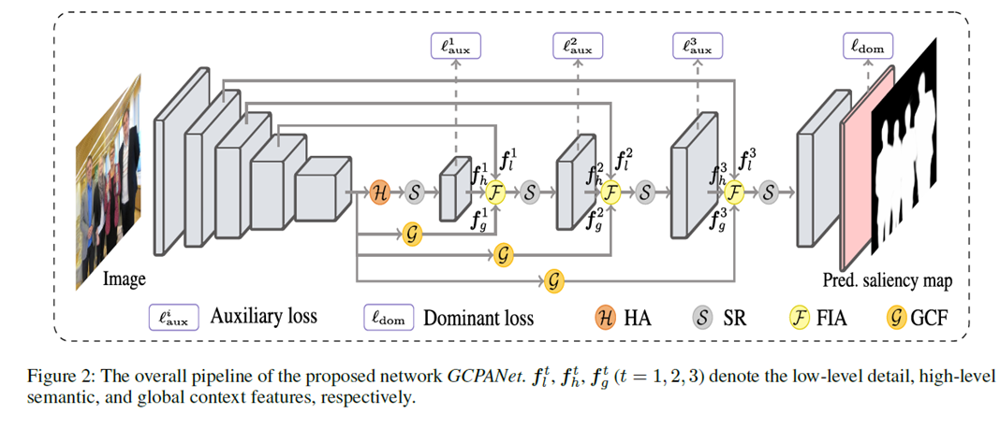
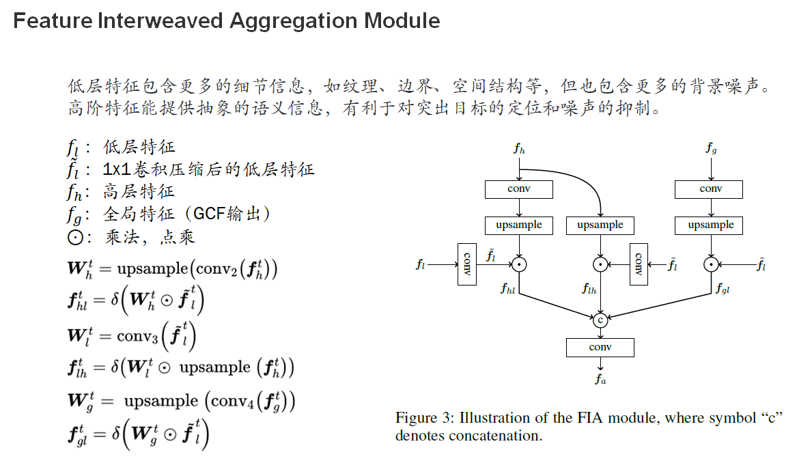
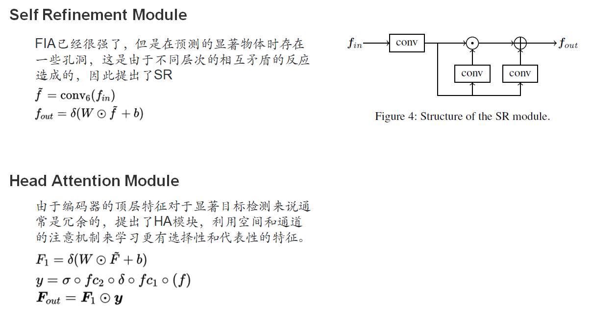
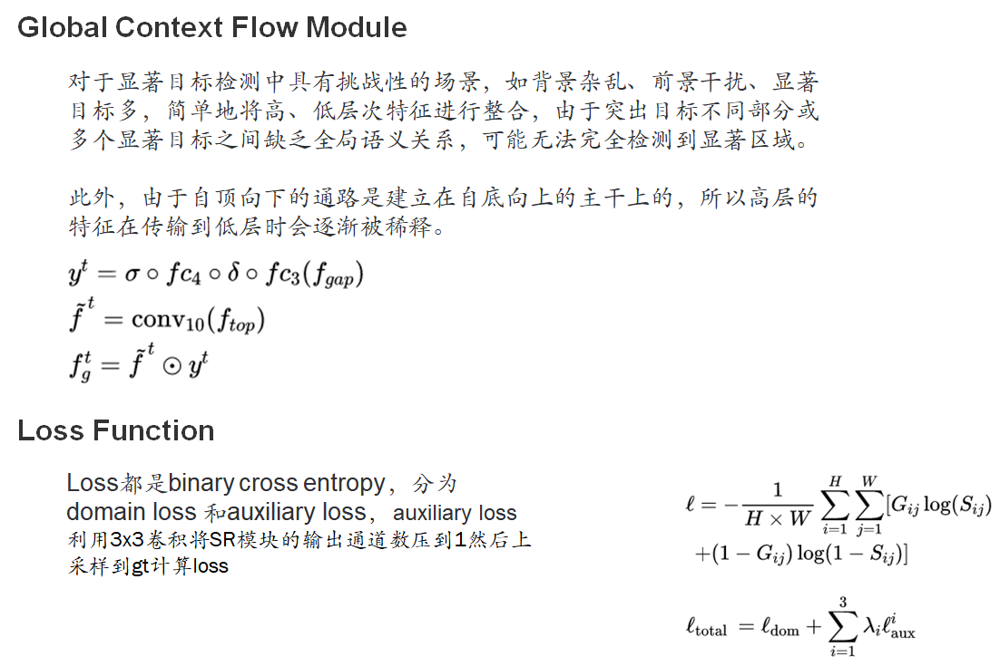
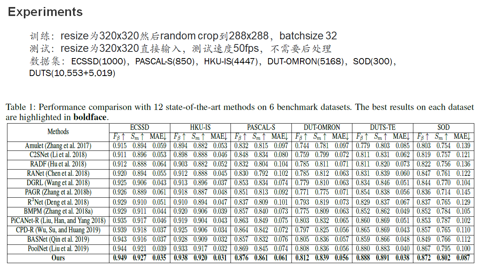
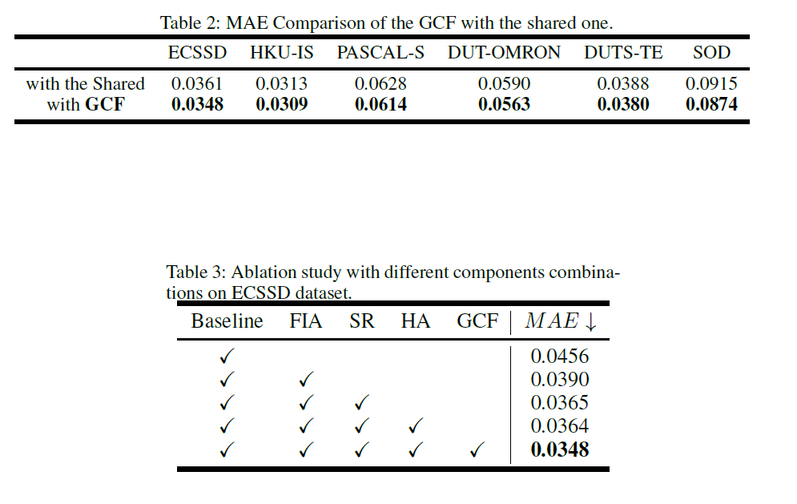
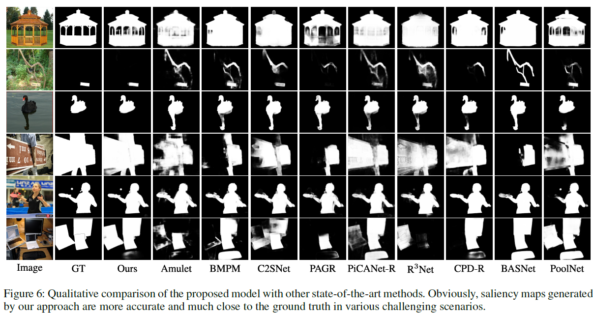

## Global Context-Aware Progressive Aggregation Network for Salient Object Detection（AAAI oral 已开源）

#### 作者：Zuyao Chen, Qianqian Xu, Runmin Cong, Qingming Huang

#### 机构：University of Chinese Academy of Sciences, Beijing, China

深度卷积神经网络对**显著目标检测**的有效体现在**特征提取**上

以往的工作大多采用多层特征集成，忽略了**不同特征之间的差异**。此外，**高层特征在自上而下的路径上传递过程中也存在稀释过程**。

为了解决这些问题，我们提出了一种新的网络，称为GCPANet，通过一些渐进的上下文感知功能交织聚合(FIA)模块，有效地**集成低层外观特征、高层语义特征和全局上下文特征**，并以监督的方式生成显著性映射。此外，头注意(HA)模块通过利用**空间和通道**的注意力来**减少信息冗余和增强顶层特征**，并利用自细化(SR)模块进一步**细化和增强输入特征**。此外，我们设计了全局上下文流(Global Context Flow, GCF)模块来生成不同阶段的全局上下文信息，旨在了解不同突出区域之间的关系，**缓解高层特征的稀释效应**。在6个基准数据集上的实验结果表明，该方法在定量和定性上都优于现有的方法。

> 这篇文章主要做 salient object detection, 主要的模式是分割，主要的思路是进一步加强特征提取和特征融合，估计是在FCN上面增加了一些模块来提升效果
>
> 作者提到了FIA HA SR GCF等模块来达到上面的目的，HA看起来像是Transformer里面的东西
>
> SOD含义：Salient object detection models usually aim to detect only the most salient objects in a scene and segment the whole extent of those objects.
>
> 一般认为，良好的显著性检测模型应至少满足以下三个标准：
>
> 1）良好的检测：丢失实际显著区域的可能性以及将背景错误地标记为显著区域应该是低的；
>
> 2）高分辨率：显著图应该具有高分辨率或全分辨率以准确定位突出物体并保留原始图像信息；
>
> 3）计算效率：作为其他复杂过程的前端，这些模型应该快速检测显著区域。

### Introduction

深度学习的发展对显著目标检测有很大的促进左右。FCN为代表的的工作充分的利用了目标的特征。一个结论，**一般来说，高阶特征有利于突出物体的粗定位，而包含空间结构细节的低阶特征则有利于细化边界。**然而基于FCN的方法也存在问题：由于不同层次特征之间的差异，**语义信息与外观信息的简单结合不够**，缺少考虑不同特征对突出目标检测的不同贡献;以往的研究大多**忽略了全局语境信息**，有利于推导出多个突出区域之间的关系，产生更完整的显著性结果。

GCPANet主要包含四个模块：Feature Interweaved Aggregation (FIA) module, Self Refinement (SR) module, Head Attention (HA) module,  and Global Context Flow (GCF) module. 具体的顺序如下：HA backbone FIA SR GCF

主要贡献：1.提出了4各模块 2.GCF生成全局上下文信息，FIA融合所有的特征。3.效果好

> 作者提出了FCN的两个主要问题：特征融合不好（FIA,HA,SR），忽略了全局信息（GCF）。很明显在目标检测连这两个问题已经研究了很久，不知道在显著目标检测里面是怎样的一个说法

### Related Work

(Zhao et al. 2015)集成了局部和全局的特征（FCN based）。

(Wang et al. 2016)采用递归CNN逐步细化预测显著性图。

(Hou et al. 2017)在skip layer结构中引入了短连接来捕捉细节。

(Zhanget al. 2017)将基于多分辨率的多层特征图级联起来，提出了一种边界细化策略。

......

最近，(Wu, Su, and Huang 2019)提出了一种利用注意力机制提炼高层次特征的级联部分解码器

(Qin et al. 2019)提出了一种边界感知模型，用于分割突出的目标区域并同时预测边界。

(Liu et al. 2019)对FPN结构进行了扩展，加入了金字塔池模块，融合了粗层次语义特征和细层次特征。

> 可以看到，早从15年开始，显著目标检测就有人开始关注，全局特征和局部特征的提炼，以及高效特征融合的方式，很遗憾的是作者这里并没有说他的方法和其他人的区别在哪里，这让我小小的心里充满了大大的疑惑。
>
> 从这些研究里面我们可以看到，特征融合不仅仅在目标检测领域，就算是他的子任务都是经久不衰，值得我们反复发论文的好点子。

### Methodology

该网络是一种对称的编码器-解码器结构，其中编码器组件以ResNet-50为基础提取多级特征，解码器组件以监督的方式逐步集成多级综合特征生成显著性映射。具体来说，我们首先使用了一个HA模块来增强对突出物体具有高响应的空间区域和特征通道，以及一个SR模块来通过特征细化和增强来生成第一阶段的高级特征。然后，我们逐步级联一个FIA模块和一个SR模块在三次，以学习更多的区别特征和生成更准确的显著性地图。在FIA模块中，低层细节信息、高层语义信息和全局上下文信息以交织的方式融合在一起。每个FIA模块后续的SR模块是细化粗聚集特征。需要注意的是，全局上下文信息是由提出的GCF模块产生的，它捕获了不同显著区域之间的关系，并约束了更完整的显著性预测。为了便于优化，我们将各子级的支路辅助损失与主导损失相结合。

> 可以看到，该工作仍然是一个FCN的变种，除开前面提到的四个模块和FCN完全一样。
>
> FIA用来融合多层的特征
>
> GCF用于处理最高层的特征
>
> SR用于增强每一层的特征

