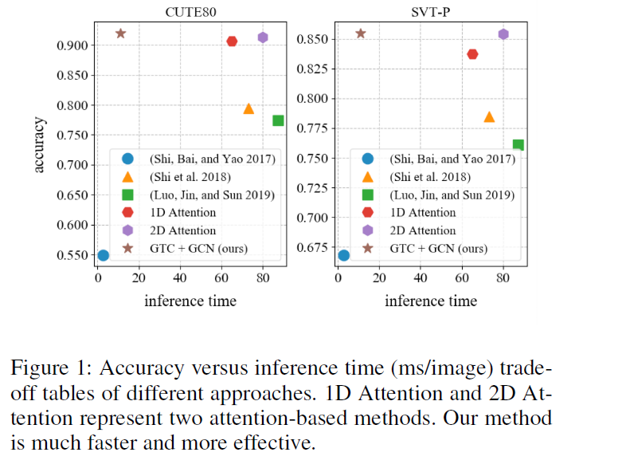
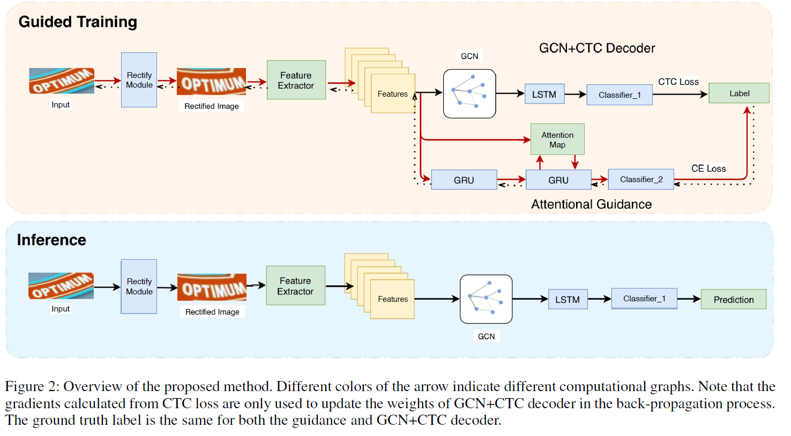
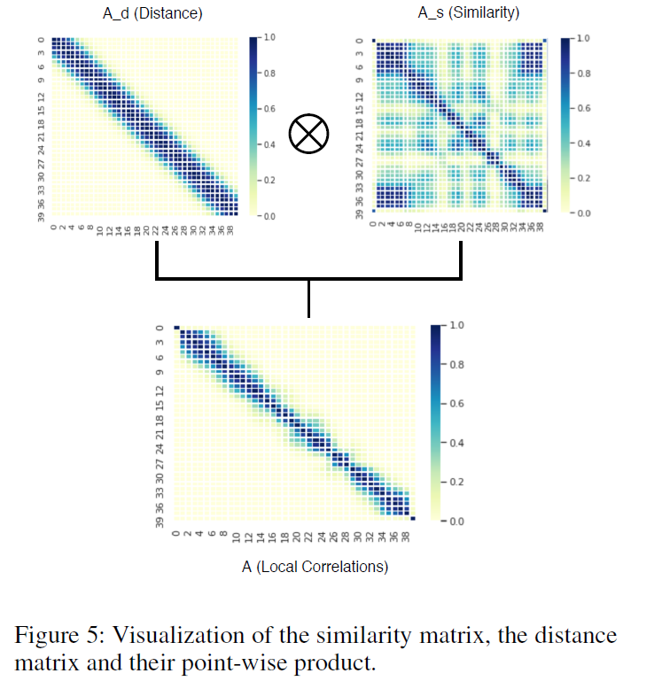
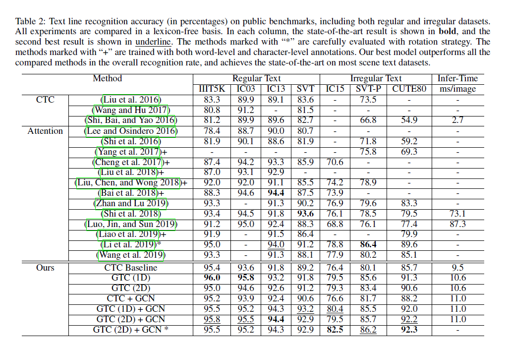

# GTC: Guided Training of CTC 		Towards Efficient and Accurate Scene Text Recognition(AAAI2020)

<u>Wenyang Hu,1 Xiaocong Cai,2 Jun Hou,2 Shuai Yi,2 Zhiping Lin1</u>

CTC和attention机制是文本识别的两种主要方法

CTC测试时间短，但是正确率低。attention则相反

作者提出了一个高效的方法，叫做guided training of CTC（GTC），该方法用**attention指导CTC学习一个更好的对其和特征表达**

效果：鲁邦，准确   可以解决不规则文本识别问题，**速度为attention方法的6**倍。

> 从速度来看的话并不是简单的结合attention和CTC的，应该抛弃了逐步预测attention的方式。

### Introduction

文字识别的挑战：different sizes, fonts, colors and character placements of scene texts

现在的文本识别框架，encoder-decoder结构+CTC/Attention。一些其他的方法使用矫正来预处理。

本文的动机：速度和准确率trade-off。(1) learning better feature representations from a more effective guidance, and (2) building correlations among the local features.

“attention-based methods make predictions depending on the features in previous time steps, this non-parallel decoding scheme will slow down the inference process a lot” 作者认为attention方法慢的主要原因是**不并行**，"where CTC loss misleads the training of its feature alignments and feature representations"，CTC效果不好的主要原因是**CTC loss误导了特征对其和特征表达**。

主要做法：使用**矫正**，训练时使用**attention监督矫正模块**，以得到更好的特征，使用**GCN提取临近特征**。

贡献：1.设计了GTC，是一个通用的提高CTC方法的方式，并且设计实验证明了。2.第一个在文本识别使用GCN。3.取得stoa性能并且速度快，能够识别规则和不规则文本。

> 可以看到其实这篇文章本质上是两条线，一个attention一个ctc，两条线直接没有任何的交叉。所以无法回避的一个问题就是他和其他既用ctc有用attention的方法有何不同。
>
> 这个思路其实和一篇ECCV很接近Using Object Information for Spotting Text，它是先标签A来训练前面的网络，然后冻住他用标签B来训练。等效于先用att训练，然后冻住stn和res来训练CTC

### Related works

和Attention or STN+Attention以及STN+CTC的区别：**guided training to optimize the CTC model，GCN**

既用ctc有用attention的方法：

(Focusing attention: Cheng et al. 2017)直接组合ctc和attention效果不好。（CTC降低了特征表示的学习效率），利用guidance效果很好。

> 这个地方其实挺好的，自从Focusing attention说ctc+attention效果不好，还真没人研究这两方法的共存问题。

(Kim, Hori, and Watanabe 2017) used a shared encoder by CTC-attention and uses attention decoder for evaluation in speech recognition。encoder and rectification model in our network are solely optimized by the gradients calculated from the guidance。

> 感觉解释依旧牵强，不同是不同了，道理没说明白。

### Method

为什么要guided：因为ctc有局限，作者认为**As labels for CTC loss calculation are ambiguous**, it is confusing to learning feature representations in each time step. Missing or superfluous characters may degrade the learning of its feature alignments and feature representations。作者利用相同编码器的ctc和att效果来说明这个问题。

主要网络结构：**STN+ResNet+att guide+GCN CTC**四部分。这里有个说法The STN, ResNet-CNN and the attentional guidance are solely trained with cross entropy loss, while the GCN+CTC decoder is trained with CTC loss.

> 看样子ctc的loss传到GCN就不再往回传了，不知道有没有相关的实验设计。后面看了一下并没有，不知道都回传是不是就变成了Focusing attention那样

STN，Res，Att都没什么好说的，用的都是标准的模型，和以前的工作一样，这里用的是GRU cell不是lstm cell。

GCN部分，也没什么好说的，用的就是Kipf的那个，和卷积本质上也没多大的区别。

这里分析一下GCN的输入和输出，"The input images are resized to have a fixed height of 64 pixels and a varying length, but not longer than 160 pixels." 可以看到假设是64x160的原图，res的下采样为16x4，“‘1D’ denotes the attentional guidance described in the Methodology.”可以推测，它的STN输出大致是16xA的大小。$h_i$ 是一个向量，$c_i$是$h_i$的线性变换，邻接矩阵$A_S(i,j) = f(c_i,c_j)=\frac{c_i\cdot c_j}{||c_i||||c_j||}$计算的是两个节点的cos相似度。这里有个额外的不同是$A_D(i,j)=\frac{exp(-d_{ij}+\beta)}{exp(-d_{ij}+\beta)+1}$作者引入了一个位置向量来衡量两个特征之间的距离。$d_{ij}=|i-j|$其实就是考虑两个时刻的特征如果隔得太远就没啥参考的意义了。

> 这里的思想其实和上下文信息的论文很类似，有点受限注意力的意思，见图5。主要是考虑“We assume neighbouring time steps have supplementary features and there are certain correlations inside the feature sequence.”
>
> 有效是肯定有效的，有点像多了一层lstm，不过计算是卷积的计算量。算是蹭了一波GCN的热度吧

> 还有一点值得注意的是，“We also evaluated GTC by using another attentional guidance from (Li et
> al. 2019), which shows the robustness of GTC. The related experimental results are denoted by ‘2D’.”这个2D怎么和STN配合的，以及怎么和CTC配合的没有说。

### Experiment

数据：We directly train our network using synthetic data (Synth90k, SynthText and SynthAdd)  and the training images provided from public benchmarks (IIIT5K, SVT, IC03, IC13, IC15, COCO), which is the same as what is described in (Li et al. 2019)

第一个结论：Use Attention to Guide CTC (GTC)好于Use CTC to Guide Attention

> 这从另一个角度印证了我前面的看法，就是本质是两个独立的分支。至于谁帮助谁就看效果好了，不过我个人认为，作者的这种guidance无疑是最简单的那种，一个简单的道理，我STN+CTC效果不好，是因为我STN效果不好，那我用ATT来训练STN，后面接CTC加速，出来的结果就是这篇文章。当然马后炮谁都会放，我觉得ATT和CTC可以更深层次的融合，之前的Triple-Net就是一种尝试，而不是简单的我帮你训练一个模块的这种结合方式。
>
> 遗憾的是给出了Use Attention to Guide CTC (GTC)    Use CTC to Guide Attention    CTC的结果，而没有给出ATT的结果。没有办法证明他的强和数据的关系到底有多大。

第二个结论：Our GTC method outperforms CTC-based methods a lot while it maintains a fast inference

> 实验虽然给的很多但是基本没有说明，比如baseline有没有STN，2D的STN到底怎么实现的，为什么加了STN效果没有SAR好，以及与后面的GCN又是怎么配合的。为什么2D ATT的效果不如1D。

此外“The result in Table 3 shows that CTC is not an effective guidance compared with Attention. The result also indicates that the CTC loss harms the training process and produces poor feature representations.“

“Besides, we find that GTC also has better transformation results compared with STN+CTC framework (see Figure 4).“

> 个人觉得后面句话才是性能增长的主要的点，什么guidance都是虚无缥缈的

总的来说

> 这篇文章虽然毒点很多，不过有很多值得称赞的地方，首先是他敢于突破“Focusing attention”的结论，我一直觉得两个方法融合是肯定会有人做的，这是很多领域共同的经验。然后就是它对这个loss不回传的设计，估计是吃了苦头的，不过他没有写都回传的效果让人难以理解。最后就是蹭了一波GCN的热度，虽然本质就是引入了领域的信息，但是瞬间论文看起来就高大上了一些。

文本检测识别的几个趋势

> 趋势1：不管我训练复杂不复杂，测试简单就可以了，可以加速，常见的套路，训练加个额外监督，反正可以学好，测试不用就完了。
>
> 趋势2：数据越用越多，反正数据多效果就好，评委也不会看出来我数据用的比别人多。
>
> 趋势3：一条路走不通时，方法融合才是硬道理，简单又高效，比如spcnet，比如htc，比如这篇