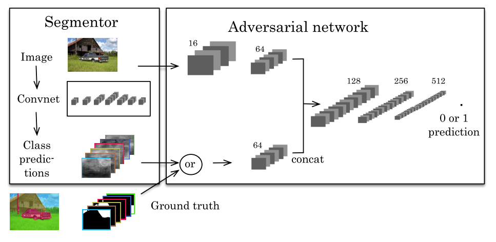
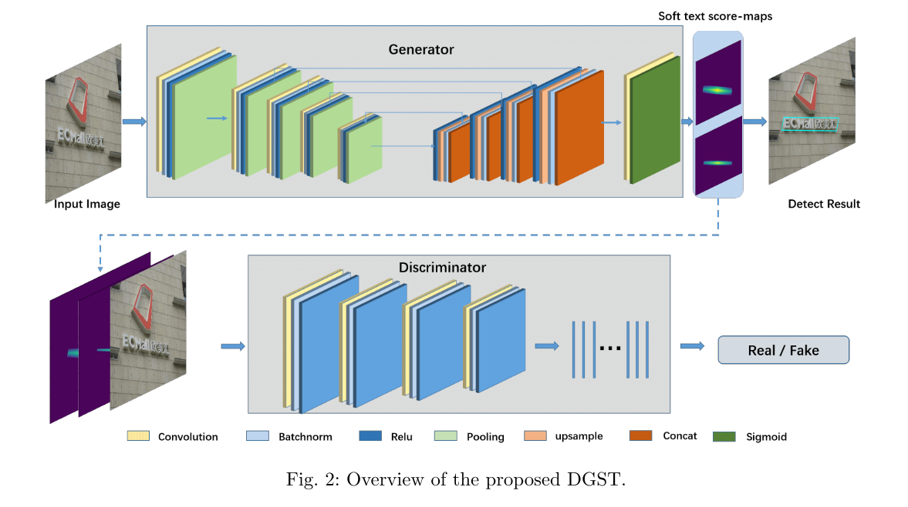
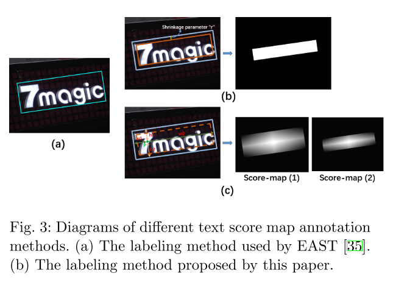
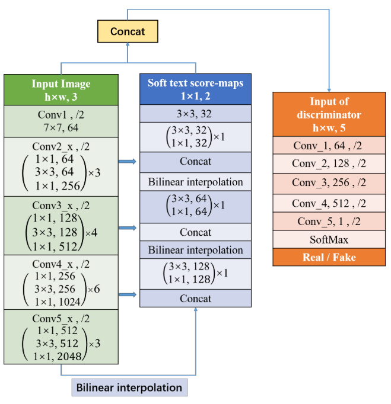
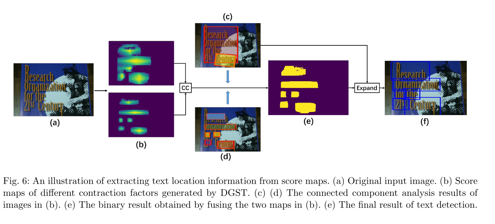
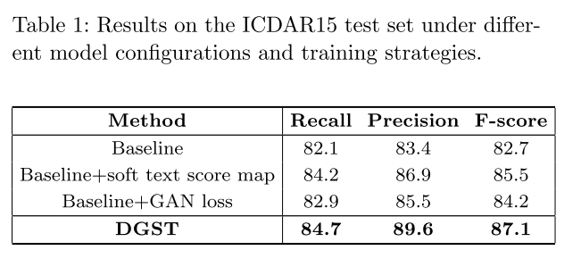
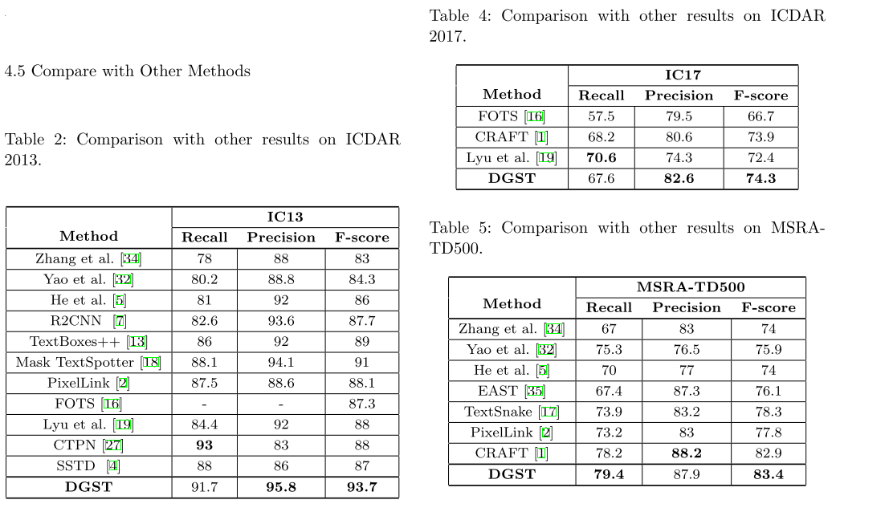

## DGST : Discriminator Guided Scene Text detector

作者：Jinyuan Zhao · Yanna Wang · Baihua Xiao · Cunzhao Shi · Fuxi Jia · Chunheng Wang
机构：自动化研究所

> 这篇文章从题目来看给人的感觉是挺不错的，目前来说GAN一般用来做图片到图片的生成包括擦除风格迁移等等，当然换个思路来说，既然能够生成，甚至是能够擦除文本，那么用来做检测也是完全没有问题的。
>
> 后来去查了一下，发现是自己孤陋寡闻了，gan用来做语义分割历史也有挺久的了，GAN在image to image translation, semantic segmentation, image style transfer方面都有很好的应用，本质上还是图片到图片不过给图片赋予了不同含义
>
> 第一个用gan来做语义分割的应该是这篇[Semantic Segmentation using Adversarial Networks](https://arxiv.org/abs/1611.08408)
>
> 

近年来，许多研究者将语义分割方法引入到场景文本检测中，取得了很好的效果。为了提高场景文本检测的分割效果，本文提出了一种基于条件生成对抗网络的检测框架DGST（Discriminator Guided scene text detector）。与现有的基于语义分割的方法生成的二值文本分数图不同，本文提出了一种**多尺度、多信息的soft文本分数图**，以更合理地表示文本位置，解决了文本提取过程中的**文本像素粘连**问题。

> 可以看到作者主要想解决的问题是分割方法的像素粘连问题，这也是分割的老问题了。另外一个贡献点是多尺度分割图，虽然目前的分割大多直接融合多尺度特征，不过我觉得也应该有多个特征图上预测分割结果的论文

### Introduction

现有的场景文本检测框架主要受到一般目标检测方法和语义分割方法的启发。基于**一般目标检测的方法通常分为两个阶段**：RPN网络提取候选文本区域，分类网络对RPN网络中的特征进行分类，得到最终的文本位置。语义分割的方法认为文本是一个特殊的语义实例直接将文本从背景中分离出来，这种方法被称为一阶段方法，与两阶段方法相比，一阶段方法更**直观、简洁**，但仍存在以下问题：

**不精确分割标签**：标注区域存在大量的背景像素，当以文本像素为目标进行像素级实例分割时，这些背景像素可能会造成学习混乱，降低训练效果。

**多任务学习问题**：一些经典的单阶段方法，如EAST[35]采用从同一卷积网络中获取文本得分图和回归任务所需特征的策略。然而，回归信息作为一种距离测度，不能很好地与基于图特征的文本评分图共享CNN网络提取的特征，其性能略弱于两级检测器。

> 这里作者主要做的是分割，所以着重分析了分割的问题。第一个是不精确的分割标签，这一点其实是很有道理，我们很早也讨论过是否有必要对文本区域逐像素的进行标注，因为目标检测就是这么干的，而对于文本来说，逐像素的标注成本过于高昂导致没什么人这么做，希望作者能对这个问题有自己的解决方法。不过这里我有一个地方不太认同，作者认为这种多任务学习（回归和文本得分）不能很好得增强效果是一阶段性能没有二阶段好的原因。首先多任务学习大家普遍认为都是带来提升的，硬要说回归和分类特征不太好认为是多任务也不是全无道理，不过二阶段方法也是这么多任务的。

贡献：

- We introduce the framework of generative adversarial networks into the task of scene text detection and design a suitable structure for it.
- We redefine the representation of text area and non-text area in the framework of semantic segmentation, and solve the learning confusion caused by back- ground pixels.
- Extensive experiments demonstrate the state-of-the-art performance of the proposed method on several benchmark datasets.

### Related Works

作者首先介绍了基于通用目标检测框架的检测方法，这些文本检测器将单词或文本行作为一个特殊的对象，并添加后续的分类符来过滤卷积特征中的文本区域。通常，这些方法需要添加NMS来获得最终的文本位置。

然后作者介绍了基于语义分割的方法，这里作者着重强调了PixelLink，PSENet和Textfield

最后作者介绍了GAN相关的方法，主要是GAN，CGAN，CycleGAN以及他们的变体。

在上述方法的启发下，本文采用生成性对抗网络框架，设计了更合理的软文本评分图，以获得更准确的语义分割结果，并用连通成分分析代替传统的NMS过程。这不仅避免了标签不精确造成的学习融合，而且使整个网络训练过程成为一个单一的任务学习过程，更加简洁直观。

> 这里比较遗憾，我以为他代替NMS过程是什么新的东西，然而分割方法本身都不用nms

### METHODOLOGY

图2示出了所提出的场景文本检测方法的流程图，该方法是一个单阶段检测器。在训练过程中，生成器和判别器交替学习，使生成器最终将输入的场景图像转换成相应的soft文本分数图。这消除了中间步骤，例如候选方案、阈值和预测几何形状的NMS。后处理部分只包括联通成分分析。

Label Generation：针对不精确分割标签的问题，其中一些方法试图更**紧密地缩小**（shrink）注释框以减少背景像素，如图3（a）所示。然而，这样的刚性收缩并不能准确地调整每个文本框的标签，并且文本边缘和背景像素也不能很好地区分，这使得最终的文本框位置偏离了预期的结果。CRAFT将文本行注释分为单个字符注释结果，通过测量每个字符上的**高斯**距离得到文本得分图，进一步减弱了背景噪声对文本特征提取的影响，但从字级注释到字符级注释的转换带来了额外的复杂工作。本文提出了一种基于标注框中像素与相应边界之间的距离对生成文本分数图的方法。在水平和垂直方向上比较标注框中的像素与相应边界之间的距离，突出显示文本行的中心位置，并弱化容易与背景混淆的边缘上像素的权重。

> 可以看到这里也没有什么特别的变化，效果甚至不一定比高斯好，看后面有没有相关的实验。这里依旧没有提到我们之前关注的逐像素的语义标签对文本检测是否有帮助。

标签的计算公式如下：
$$
\begin{aligned}
&P_{(x, y)}=\left\{\begin{array}{ll}
\frac{1}{2} \times\left(D_{w}+D_{h}\right) & ,(x, y) \in T_{i} \\
0 & ,(x, y) \in \text { background }
\end{array}\right.\\
&D_{w}=1-\frac{\left|w_{i 2}-w_{i 1}\right|}{w_{i}}\\
&D_{h}=1-\frac{\left|h_{i 2}-h_{i 1}\right|}{h_{i}}
\end{aligned}
$$
Network Design:

生成器就是一个简单的res50+UNet，这里使用双线性差值来进行上采样。和east很接近。可以看到判别器是一个全卷积网络，是一个简单的二分类分类器。

生成器的训练没啥好说的就是一个分割，判别器的训练：

Combining the original picture with the corresponding text score maps of different shrink factors as the input of the discriminator, the discriminator determines whether the input text score map is a labeled ground truth image or an imitation of the discriminator.

> 可以看到这里的训练模式在图2说的不是很明白，倒是和第一张图是一样的。

LOSS:两个损失函数如下所示：
$$
L_{c G A N s}(G, D)=
E_{x, y}[\log D(x, y)]+E_{x, z}[\log (1-D(x, G(x, z)))]\\
L_{L 2}(G)=E_{x, y, z}\left[\|y-G(x, z)\|_{2}\right]\\
$$
其中第一项是CGAN的通用公式，第二项是作者用来训练text score map（生成器）的loss，是一个L2loss

Text boxes extraction ：

分割方法无可避免的就是后处理，这篇文章的后处理也很复杂，从生成器中获得两个具有不同收缩因子的文本分数图，通过直接分析图6（b）中分数图的连接成分，可以得到图6（c）和图6（d）中相应的文本框。可见，非收缩分数图存在内聚问题，收缩分数图能较好地提取文本框间距信息，但会丢失一些文本信息。

> 这一步骤类似PSENet的做法

因此，我们将生成器中的两个分数图组合起来得到一个更完整的图像，如图6（e）所示，并在图6（c）中文本框的约束下展开图4（e）中的文本框，以便边缘可以完全包围整个文本区域。最终文本框位置如图6（f）所示。算法1显示了更具体的过程：

### EXPERIMENTS 

> 总的来说，这篇论文没有特别出彩的地方，有点将16年的Semantic Segmentation using Adversarial Networks结合PSENet直接迁移到文本检测领域的味道，不过使用GAN来做检测，特别是用discriminator来给我们的检测器提供一个额外的监督是一个可以尝试的做法，毕竟他在测试的时候可以不用引入已提供额外的计算，在训练的时候反而能够用多任务的形式给我们的检测器带来额外的矫正。和端到端中识别器矫正文本检测结果有异曲同工之妙。