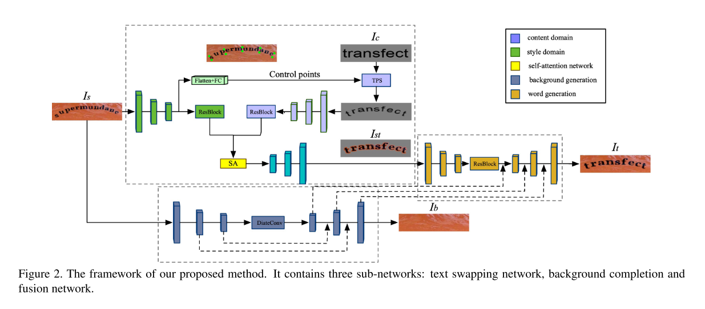
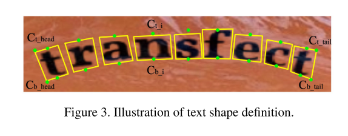
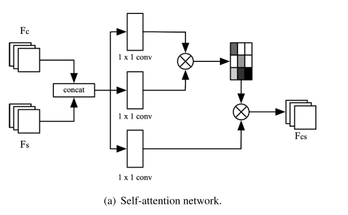
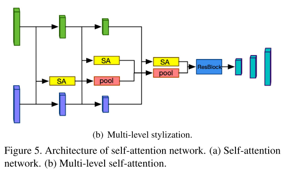
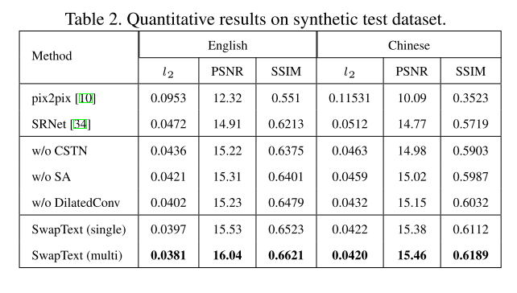
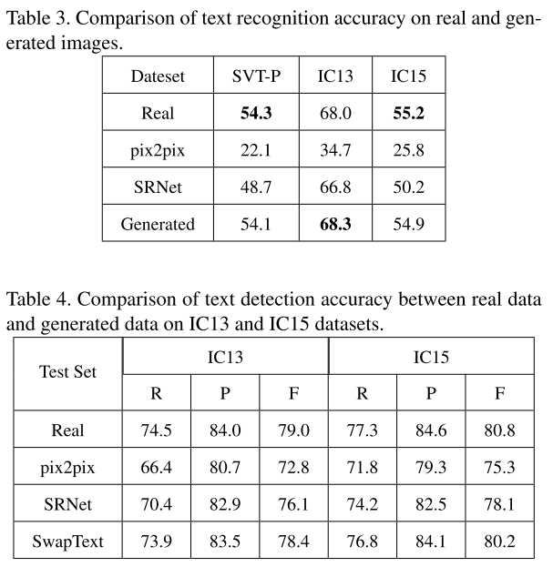

## SwapText: Image Based Texts Transfer in Scenes

作者：Qiangpeng Yang, Hongsheng Jin, Jun Huang, Wei Lin
机构：Alibaba Group

这篇文章主要解决了自然场景中文本替换的问题，文本替换的目的是在保留原始的字体、颜色、大小以及背景纹理的同时替换文字的内容。

> 一个类似的任务是文本擦除，其实这两个任务本质上区别应该不大，所使用的的主流方法也是一样的，都是用gan来做。

为了解决文本替换的问题，本文提出了一个三阶段的方法：首先利用text swapping network替换前景中的文字，然后一个background completion network用来补全对应的背景，最后fusion network负责融合前景和背景。

### Introduction

作者首先介绍了一下文本替换有什么用

> 说实话我一直不是特别理解文本替换的意义是什么

文本交换或文本替换在许多情况下都是相关的，包括文本检测、文本识别、海报中的文本迁移和其他创造性应用。对于文本检测和识别任务，文本交换是一种非常有用的**数据扩充方法**。虽然已经有很多方法尝试生成合成数据，然而，合成图像与场景中的图像并不完全一致，这在应用合成图像训练DNN模型时至关重要。

> 这一点我觉得挺有道理的，检测任务不需求生成图像，是因为生成图像索能起到的作用确实不大，比如900k的synth text并不如9k的MLT17做预训练效果好。很重要的原因是合成图像里的文字出现的位置经常是不合理的。不过识别的可能意义就没有这么大了。
>
> 文本替换相比于生成的方法或许真的能够在生成数据方面更有效果，不过他的缺点就是**背景是固定的**。**如果能配合一个高效的辨别图像中是否存在文本的分类网络**或许在互联网环境下能发挥巨大的作用。特别是针对小语种或者不常见的语种。

作者受到了很多基于GAN的图像生成工作的启发，针对自然常见中的文本替换任务提出了SwapText作为解决方案。采用分而治之的策略，将问题分解为文本交换网络、背景完成网络和融合网络三个子网络。在文本交换网络中，**内容图像和风格图像的特征**被同时提取出来，然后通过一个**自注意力网络**进行组合。为了更好地学习内容图像的表示，我们使用**内容形状转换网络（CSTN）**根据样式图像的几何属性对内容图像进行变换。根据我们的实验，这个转换过程显著地改善了图像的生成，特别是对于透视图像和曲线图像。然后，利用背景完成网络生成风格图像的背景图像。因为我们**需要删除样式图像中的原始文本笔划像素**，并根据内容图像填充适当的纹理。最后，将文本交换网络和背景完成网络的输出输入到融合网络中，生成更真实、语义更连贯的图像。整个框架是端到端可训练的，在几个公共基准上的大量实验证明了它在有效性和效率方面的优越性。

> 这里主要介绍了一下SwapText的主要模块，当然前面已经说过了。从这里部分可以看出来他的重点是一个self attention和一个CSTN，后面的背景完成网络或许就是文本擦除任务使用的网络，从目标来看是一致的。最后的模块暂时猜不到是怎么实现的，和直接拼凑的区别又是什么。

贡献：

- 我们设计了一个端到端的交换文本框架，它包含三个子网络：文本交换网络、背景完成网络和融合网络。
- 我们提出了一种新颖的文本交换网络，在保持原始风格的同时，替换场景文本图像中的文本。
- 我们用高质量的视觉结果演示了我们的场景文本交换方法的有效性，并展示了它在文本图像合成、基于图像的文本翻译等方面的应用。

> 说实话我觉得贡献不是特别的大，或许是我的眼光太狭隘了。

### Related Works

**文本合成**：文本图像合成的目标是在背景图像的语义敏感区域插入文本。许多因素影响合成文本图像的真实相似性，如文本大小、文本透视、环境光照等。结合语义连贯、视觉注意和自适应文本外观三种设计，实现了逼真的文本图像合成。虽然文本图像的合成在视觉上是真实的，但是合成图像和真实图像有很多不同。例如，与真实图像相比，合成图像中文本和背景图像的字体非常有限。

Spatial fusion gan for image synthesis.

Controllable Artistic Text Style Transfer via Shape-Matching GAN.

GA-DAN

Multi-content gan for few-shot font style transfer. 

Editing Text in the Wild.

**图像生成**：这部分方法主要包括GANs  VAEs and autogressive models。作者主要介绍了和GAN相关的工作

GAN，CGAN

Pose guided person image generation

Disentangled person image generation.

Fast face-swap using convolutional neural networks.

**图像补全**：

9：Globally and locally consistent image completion.

38：Generative image inpainting with contextual attention.

33：Image inpainting via generative multi-column convolutional neural networks.

> 这里我稍微有个疑问就是Editing Text in the Wild.这篇

### METHODOLOGY

本文的网络结构如上图所示，网络的输入是$I_s$，$I_c$。主要包括三个部分，第一个部分负责预测控制点进而完成$I_c$的风格迁移，第二部分负责文本擦除，第三部分负责将迁移之后的文本嵌入到擦除之后的图片上。

> 可以看到整个pipline是非常复杂的，不过目前尚不知道有多少个监督信息。理论上来说可以只有一个监督，不过对于GAN来说这可能太难了。这里作者没有说明$I_c$的来源，看起来应该是直接打印到黑白图上面的。

**Content Shape Transformation Network**:在这一部分作者首先定义了文本的形状，用来描述任意形状的文本，这里借助了TPS，STN那一套思路。一个图就明白了。然后作者从这么多点里面随机采2K个点，K设置为5。这里引入了第一个监督，损失函数为smooth L1。然后就可以用TPS把$I_c$的形状变得和$I_s$一致了。

**Self-attention Network**: 这一部分主要负责进行颜色、字体上的风格迁移。输入两个特征，会通过下图b所示的多级的self attention模块来加强特征，这一部分的监督信息如下：
$$
\mathcal{L}_{s w a p}=\left\|G_{s w a p}\left(I_{s}, I_{t}\right)-I_{s t}\right\|_{1}
$$
$I_{s t}​$这里是gt，整体是一个L1 loss。$G_{s w a p}​$表示text swapping network

> 这一部分仍就没有什么好说的，不过结构倒是挺复杂的，$I_{s t}$必须和$I_s，I_c$配对，大致可以猜到所有的东西全部都应该是生成图像，真实图片很难保证这一点。从这个角度来看，这种思路比运用了cycle gan的GA-DAN要差。

**Background Completion Network**:这一部分负责擦出文本，结构和擦出文本的论文也没也特别大的区别，主要是一个全卷积网络，里面用了空洞卷积以及反卷积。不过这里没说判别器$D_b$是怎么设计的。不过影响不是特别大：这一部分的监督如下：
$$
\begin{aligned}
\mathcal{L}_{B}=\mathbb{E}\left[\log D_{b}\left(I_{b}, I_{s}\right)+\log \left(1-D_{b}\left(\hat{I}_{b}, I_{s}\right)\right)\right]+
\lambda_{b}\left\|I_{b}-\hat{I}_{b}\right\|_{1}
\end{aligned}
$$
主要的损失函数是一个传统的GAN的损失以及一个L1，$\lambda_{b}$设置为10，I_{b}​$是一个gt

**Fusion Network**：和前面的Background Completion Network基本没有区别，唯一的区别可以看fig2里面的说明。可以看到，损失函数也是一样的：
$$
\begin{aligned}
\mathcal{L}_{F}=\mathbb{E}\left[\log D_{\text {fuse}}\left(I_{t}, I_{c}\right)+\log \left(1-D_{\text {fuse}}\left(\hat{I}_{t}, I_{c}\right)\right)\right]+
& \lambda_{\text {fuse}}\left\|I_{t}-\hat{I}_{t}\right\|_{1}
\end{aligned}
$$
同样这里$\lambda_{\text {fuse}}$是一个超参数，设置为10，

最后它使用了2个额外的loss
$$
\begin{aligned}
\mathcal{L}_{v g g} &=\lambda_{1} \mathcal{L}_{p e r}+\lambda_{2} \mathcal{L}_{s t y l e} \\
\mathcal{L}_{p e r} &=\mathbb{E}\left[\sum_{i}\left\|\phi_{i}\left(I_{t}\right)-\phi_{i}\left(\hat{I}_{t}\right)\right\|_{1}\right] \\
\mathcal{L}_{s t y l e} &=\mathbb{E}_{j}\left\|\left(G_{j}^{\phi}\left(I_{t}\right)-G_{j}^{\phi}\left(\hat{I}_{t}\right) \|_{1}\right]\right.
\end{aligned}
$$
其中$\phi_{i}$是relu_1,relu_5的激活图，G是Gram matrix，这里我不是特别理解，作者说参考了

Image style transfer using convolutional neural networks

Arbitrary Style Transfer with Style-Attentional Networks

> 这两部分由于过于相似，放在一起讨论，
>
> 值得注意的是这里有一个额外的L1，并且权重系数为10，讲道理这里gan的损失还能发挥多大的作用值得思考
>
> 还有一点是，这里并没有用CGAN和GAN里面的噪声概念，说是生成器也没问题，不过难免给人一种强行用GAN的感觉，不过很多图像到图像的GAN都是这么用的，感觉也没有多大的毛病。从定义上来看也没什么问题。不过只保留了GAN生成的特点而丢失了随机的部分。
>
> 并且不得不吐槽他这里有很大的问题，首先论文里面提到了$G_b,G_{fuse}$，公式里看不到，这GAN的loss写的极其不规范，虽然他不写我们也知道应该是怎么样的，看起来应该是$\mathcal{L}_{B}=\mathbb{E}\left[\log D_{b}\left(I_{b}, I_{s}\right)+\log \left(1-D_{b}\left(G_b(\hat{I}_{b}, I_{s})\right)\right)\right]$，而且，minmax也没有。

### EXPERIMENTS 

Evaluation Metrics 

• MSE, also known as l2 error.
• PSNR, which computes the the ratio of peak signal to noise.
• SSIM, which computes the mean structural similarity index between two images
• Text Recognition Accuracy, we use text recognition model CRNN [31] to evaluate generated images.
• Text Detection Accuracy, we use text detection model EAST [43] to evaluate generated images.

作者是实验设计参考了白翔老师的Editing Text in the Wild. table2就没什么好说的了，作者验证每个模块的作用，当然都是有必要的。本来就是一个复杂的任务，更复杂的backbone大概率带来更好的效果。

table3和table4做了一下相同检测器在生成图片上的检测和识别结果，表达的意思是，我生成的图片更接近于真是图像，因为同一个检测器检测我和真实数据的效果差不多。

> 实验部分也没有这几个GAN的损失的消融实验，这大概就是pipeline复杂的好处吧，刻意回避很多问题。只做大模块的消融实验。不过作者确实没说GAN是他的贡献。就算不用GAN的损失也不影响什么。

> 局限性：第一就是训练数据太少了，这一点前面已经分析了，作者也明确指出来了，第二点就是Our proposed method fails when the text in style image is waved，过于复杂的形状控制点数量不够的话可能就不太行。当然也可能是TPS这种方式本身就不适合做波浪线这种过于复杂的曲线。

> 这篇论文可以说自己的东西并不多，更多的是拼凑一些前人的工作，用了一些先进的黑科技以求最好的解决问题，这可能就是公司的科研风格吧，反正他们也不是非要发论文。我个人认为，这种pipeline做文字替换肯定不是最好的，明显是可以一步到位的，只需要一个GAN就可以搞定。完全没有必要这么复杂的pipeline。