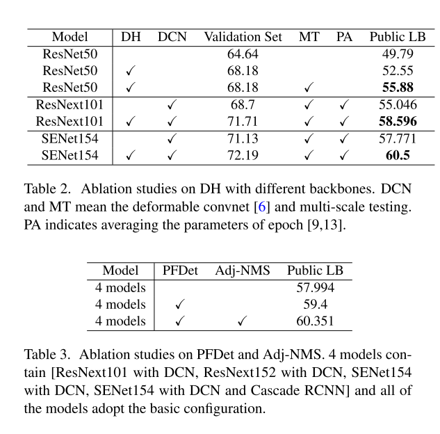

## 1st Place Solutions for OpenImage2019 - Object Detection and Instance Segmentation

作者：Yu Liu, Guanglu Song, Yuhang Zang, Yan Gao, Enze Xie, Junjie Yan, Chen Change Loy, Xiaogang Wang
机构：The Chinese University of Hong Kong, SenseTime Research

> 这篇论文更多的是技术报告，里面提到的思想之前的方法都已经有所体现。不过作为第一名的技术报告，还是值得仔细分析的。

在这篇文章中作者出发点是**目标检测框架中分类的回归任务对于特征的要求不同**。然后提出了**Adj-NMS**来代替soft-nms。最后给出了一些训练测试策略来提升最终效果。

> 这里我摘抄一下大佬的分析：**分类**任务希望无论目标的位置和形状怎么变化，什么类别的目标就是什么类别，即需要保证**平移和尺度的不变性**。**回归**需要保证目标的位置和形状变化反映在特征上，进而回归得到位置，即**平移和尺度的相等性**。来源：<http://bbs.cvmart.net/topics/1661>
>
> 简单的来说，对于分类任务而言，我们要求特征是对空间位置不敏感的，一个简单的例子我们无论给的是牛身体的某一个部分或者是全体都希望能分类为牛。而对于回归任务就不同了，如果给的是整体我们希望能收缩anchor，使其更紧密，如果是部分我们则希望扩充anchor，而且不同的部分扩充的方向不尽相同，这也就是说我们需要特征对空间位置是敏感的。
>
> 这里再补充一下相等性。这个概念其实是和卷积一致的，卷积的滑动窗口所具备的性质就是平移相等性。

### Datasets 

使用的是：OpenImages Challenge 2019 Object Detection，这个数据集是OpenImages V5 dataset的子集，一共1.74M图片，14.6M bounding box，500类，包含不同的级别。因为是分级的类别，包含父类和子类关系，测试的时候扩展了父类的标签（雾），作者使用了整个OpenImages V5的图像级标注和分割标注用来数据增强和弱监督。我们还使用COCO和Object365为重叠类别训练一些专家模型。

### Decoupling Head

> Decoupling Head利用传统的ROI Pooling主干预测anchor的粗略位置，然后用deform conv的方式校正分类分支。再在主干上保留原始的回归和分类任务。总而言之可以将其概括为：Double Head RCNN + AlignDet(或GA-RPN) + Faster RCNN

**Decoupling Head**从名字上来看就知道是为了解决目标检测框架中分类的回归任务对于特征的要求不同这个问题而存在的，正常的Faster RCNN框架，这两个特征是耦合在一起的，只在预测阶段使用不同的FC层来转换特征，这是远远不够的。

首先作者介绍了一下相关的研究工作，第一个研究类似问题的工作是IoU-Net，他们发现产生良好分类分数的特征总是预测一个粗糙的边界框。为了解决这个问题，他们首先引入一个额外的头部来预测IoU作为定位置信度，然后将定位置信度和分类置信度相加作为最终的分类得分。这种方法确实减少了偏差问题，但以一种折衷的方式——其背后的基本理念是相对提高一个紧边界框的置信度得分，并降低一个差边界框的得分。在每个空间点上仍然存在偏差。

> 我们关注IoU-Net已经很久了，不过我们的看法是，回归效果好的框的置信度并不总是得分是最高的，所以IoU-Net试图给回归好的框重新打一个分，解决简单的分类任务置信度不能代表回归结果好坏的问题。这看起来是对一个问题不同方面的分析，不过遗憾的是我们并没有试图从特征层面来解决这个问题，而是借鉴了IoUNet的方法付试图从引入一个额外的score方式来解决这个问题。一个典型的类似的方法就是mask scoring cnn。

沿着这一方向，Double-Head R-CNN被提出将姊妹头分支重新划分为两个特定的分支进行分类和定位。尽管每个分支都经过了精心的设计，但通过添加一个新的分支可以认为是对信息的分离，实质上减少了两个任务的共享参数。虽然这种检测头的分离可以获得令人满意的性能，但是由于输入到两个分支的特征是由同一个方案的RoI Pooling产生的，因此这两个任务之间的冲突仍然存在。

> 可以看到，旷视的Double-Head R-CNN应该是第一个明确的将这个问题摆到明面上的论文了，值得一提的是Double-Head R-CNN当时也拿到了coco比赛的第一名。下面放一个结构图：
>
> 
>
> 可以看到，大体上这篇论文的思路是在Double-Head R-CNN更近了一步，换句话来说他没有考虑到anchor与特征的对齐关系。anchor与特征对齐的研究也有很久的历史了，包括RefineDet，Reppoints，Guided Anchoring，AlignDet。一个简单的解释是，不同的anchor具有不同的形状，而在特征图上他们对应着同一个区域（或者点）的特征，这是不合理的。

最后作者解释了一下他们想法的来源：这是受到自然洞察力的启发，例如，某些显著区域的特征可能具有丰富的分类信息，而这些边界周围的特征可能擅长边界盒回归。

#### Detail description 

如图1所示，与Faster RCNN中的原始检测头不同，在DH中，我们通过自学习的逐像素偏移和全局偏移来分离分类和回归。DH的目的是寻找分类和回归的最佳特征提取。此外，为了便于DH的学习，我们提出了可控边际损失（CML）来推动整个学习。

首先作者通过两个FC来学习分类回归任务的特征偏移：
$$
\begin{aligned}
&C=\mathcal{F}_{c}\left(F ; \theta_{c}\right)\\
&R=\mathcal{F}_{r}\left(F ; \theta_{r}\right)
\end{aligned}
$$
其中F表示RoI Pooling的特征，$\theta$表示FC的参数。DHPooling是一个带offset的ave pooling过程。具体计算公式如下：
$$
\mathcal{C}(i, j)=\sum_{0 \leq i, j \leq k} X\left(p_{0}+p_{i, j}+C_{i, j, *}\right) / n_{i, j}
$$
X表示输入特征图，n表示roipooling bin中点的数量，$p_0$表示bin中最上角的点，可以看到，拿掉C就是一个avepooling，对于回归的公式完全一样这里就不列了。CML的定义如下：
$$
L_{c}=\left|S_{o}-S+m_{c}\right|_{+}\\
L_{r}=\left|I o U_{o}-I o U+m_{r}\right|_+
$$
$S_o$是原始box head里面的分数，$S$是DH投中的分类分数。$|\cdot|_+$和relu一样，$m_c$是一个预设的阈值，回归分支的含义同理，这里$m_c,m_r$设置为0.2

> 可以看到作者这里设计的思路是：DH分支中预测的S以及IoU应该更准确，$S,IoU$相比$S_o, IoU_o$太小时需要产生loss来使得他们预测正确。应该是一个加速收敛的loss。

### Adj-NMS

Adj-NMS是NMS和soft-NMS的结合，这一部分作者说的比较模糊，应该是先进行一个阈值为0.5的NMS，然后采用一个rescore函数为$w=e^{-\frac{I o U^{2}}{\sigma}}$的soft-NMS。这里作者说$\theta$设置为0.5。

> 一开始我还以为是什么nb操作···不过这里这个方法其实有丶东西，soft-NMS取代NMS的思路是不完全抑制IOU很大的情况因为考虑到框可能很密集，而overlap越高的情况下得分其实是越低的，这时使用NMS完全没有什么问题，这也就意味着NMS可能确实和softNMS是可以在某种程度上互补的，这和我们目标的密集程度有关。假设当前框得分最高为1，那么经过NMS之后与他最大的IoU的框得分最多为$0.99\hat 9$，和其IoU最大为$0.49\hat 9$那么代入公式，他的得分会被抑制到0.606,比该框overlap还大的框得分会小于0.606，我们需要判断的就是小于0.606置信度的框对ap到底是有利的还是有害的。

### Model Ensemble

#### Naive Ensemble

模型集成作者采用了PFDet中的方法和常用的投票策略，给定bounding boxes(P)，以及topk个与之IOU较高的候选框，首先依据验证集的分数**用PFDet中的方法**来分配各个模型在集成时的权重，然后进行**第二次加权**：
$$
C=S_{\mathcal{P}}+0.05 * \sum_{i=1}^{k} S_{P_{i}}\\
B=0.7 * B_{\mathcal{P}}+\frac{0.3}{k} * \sum_{i=1}^{k} B_{P_{i}}
$$
k设置为4，

> PFDet中的方法我不清楚，这里第二次加权就是一个简单的投票过程，不过不是很懂为啥C可以超过1.

#### Auto Ensemble

作者使用不同的模型结构、数据集、类别划分策略、数据增强和监督训练了28个检测器。首先使用上面提到的朴素模型集合具有相似设置的检测器，从而将检测从28减少到11。然后我们设计并启动了一个自动集成方法，将它们合并为1。

> 可以看到，有钱真的可以为所欲为

这里作者将模型集成过程变换为二叉树生成过程。所有父节点都是其子节点通过一组操作的集合，根节点将是最终的检测。在比赛中，作者采用两阶段的搜索过程：首先，作者为每个子节点搜索贡献相等的二叉树结构；然后，作者基于固定树搜索父节点的算子。

> 这一部分太简略了，完全不懂具体是怎么做的。可能是先搜索可能的节点结构，11个叶子节点所能生成的二叉树结构有？种，然后在遍历所有的父节点操作。这父节点操作可能需要离散化以减小搜索空间。

这里作者提到了autoEnsemble leads to 2.9%, 3.6% and 1.2%, 1.0% improvement on the two validation sets and ∼0.9% on the public lead-board compared to the Naive ensemble.

### Bag of Tricks for Detector

> 这一部分应该是打比赛的关键了，当然上面的ensemble也很重要。

#### Sampling

首先是处理长尾数据的方法：采样

确保500个类别的目标中各个类别被选取的概率相等。作者这里使用采样和不采样的**差距有5.76个点**。

> 采样对于长尾分布数据还是非常有效的，没有采样甚至可能无法收敛，这里应该是过采样策略。

#### Decoupling Backbone

对于第25~28个模型，在特征步长为8的特征图上采取Decouple Head的策略，一个分支专注于分类任务，其中回归被赋予较低的权重，而另一个分支则相反。

#### Elaborate Augmentation

由512个加速器训练的模型中采取full class batch和elaborate augmentation策略，full class batch表示每个batch中每个分类的样本至少一个，elaborate augmentation随机选择一个类别，利用旋转放缩裁剪等方式进行数据增强

> 我不是很理解这么做的用意，这里选了一段别人的理解：**这样可以使得一幅图中的类别数变少，缓解数据不平衡问题。**不过看了这个说法我还是不懂甚至怀疑他说的有问题。

#### Expert Model

专家模型是指在数据集的一个子集上训练检测器来预测类别的一个子集。其动机是，一般模型很难在所有类中都表现良好，因此我们需要为专家模型选择一些类别，以便专门处理

专家模型有两个重要因素需要考虑：the selection of positive and negative categories, and the ratio between the positive and negative categories. 其中the selection of positive and negative categories需要考虑到类别之间的混淆。作者从分级类别、混淆矩阵和视觉相似度三个角度来定义易混淆的类别。然后设计了专家模型的训练方式：

1.选择初始类别$C_{pos}$，例如验证集map的最低十个类别。将包含$C_{pos}$的图像添加到positive数据子集$\chi_{pos}$。

2.使用余弦矩阵添加混乱的类别。对于满足$dist（c_i，c_j）>thr，c_j⊆C_{pos}​$要求的每一类$c_i​$，将其添加到$C_{neg}​$中。$thr​$等于0.25，以确保正负数据的比率接近1:3。将含有​$C_{neg}​$的图像添加到阴性数据集​$\chi_{neg}​$。

3.训练一个带有$\chi_{pos+neg}$的检测器来预测$C_{pos}​$的种类。

该检测器在推理阶段，每个RoI都有一个对应的分类分数，shape为（$C_{pos}+1$）。如果背景分类得分大于所有其他前景得分，则此RoI将不会进行回归。这种修改可以减少很多不必要的假阳性样例。

> 这个专家模型应该效果非常好，设计思路也很有效。打比赛的时候应该可以借鉴。不过对于文本检测可能没有作用。

#### Anchor Selecting

we have 18 anchor(ratio:0.1, 0.5, 1, 2, 4, 8. scale:8, 11, 14)

#### Cascade RCNN

这一部分没啥好说的，迭代回归就是强。

#### Weakly Supervised Training

同样是处理长尾问题，这里采用弱监督加入额外的训练数据

具体来说是集成弱监督检测器WSDDN和全监督检测器Faster-RCNN，然后通过端到端训练的模式来同步提升两个检测器的性能，当遇到有包围盒的数据时，利用它训练全监督检测器，约束弱监督检测器。在遇到图像分类级数据时，利用它来训练弱监督检测器，并从弱监督结果中挖掘伪真值来训练全监督检测器。

> 这里我不理解的是faster rcnn是不是应该对应最终的模型，还是说重要的是挖掘出来的伪gt标注。不过这种方式也是有效的。可以借鉴用来做LSVT。

#### Relationships Between Categories

OpenImage数据集中的类别之间有一些特殊的关系。例如，有些类总是与其他类一起出现，比如Person和Guitar。在训练集中，90.7%的图像中出现了有吉他的人。所以当检测到一个置信度很高的吉他包围盒，并且有一个置信度较高高的人包围盒时，我们可以提高这个人包围盒的置信度。

这里作者使用条件概率来计算上面提到的co-occurrence relationship，此外作者还提到了surround relationship and being surrounded relationship。这些类别之间的特殊关系可以作为提高或降低某些包围盒可信度的证据，从而提高检测性能。

> 感觉这种方式实际操作没有这么简单，作者直接设计启发式规则来完成语义信息的融合，其实如果能想办法把这种信息编码到网络中应该是不错的一个思路。

#### Data Understanding

作者发现OpenImage数据集中对于特定类别的目标标注有歧义，比如火炬和手电筒，剑和匕首等，所以作者将有歧义的类别细分成了上面说的多类。同时作者也发现有些目标，比如葡萄缺乏个体检测框等，作者就利用葡萄串的实例标注，扩展了很多葡萄框。

### Implementation Details

13/26 epochs with batch size 2N @ N accelerators, where ’N’s are in range of [32, 512] for different models based on the available number of accelerators.

> 这里加速器大概就是GPU等东西了，512块GPU是真的无情。

在推理阶段，对于验证集，我们直接生成结果，对于测试集，我们采用[600、800、1000、1333、1666、2000]的多尺度测试，最后的参数是通过对第[9,13]个epoch的参数进行平均（对于第2x scheduler，则为[19,26]）来生成的。基本的检测框架是FPN[18]和Faster RCNN，并使用class-aware sampling。

> 这里有个操作时对多个epoch的ckpt参数进行平均，这是我之前没见过的新操作，不知道有没有很好的借鉴意义。class-aware sampling应该指的是第一个trick吧。

### Results of Object Detection

> 这个结果我看呆了，模型集成和backbone真的是比赛第一生产力。

后面还有分割的结果，以及配套的方法，这里就不放了，有需要可以看一下。

> 这篇技术报告虽然在方法上没有很大的创新，因为方法方面会总结到论文Revisiting the sibling head in object detector里面，并且和Double Head RCNN + AlignDet(或GA-RPN) + Faster RCNN确实很类似。不过这样他确实比较好的解决了分类和回归不应该使用同一个特征的问题，起码比Double Head RCNN多考虑了特征对齐的问题。
>
> 不过从实用包括比赛的角度来看，这篇论文的价值还是非常高的。从上面的结果我们可以看到，巧妙的结构设计虽然能够帮助我们提升网络的效果，但是并没有达到饱和的程度，更加复杂有效的backbone以及模型集成方法依旧是提升我们效果的根本手段。
>
> 这里也就引申出另外一个问题，到底依靠一个检测器完成所有检测任务是否是可行的，因为这篇报告中使用专家模型包括模型集成所带来的提升确实太大了。如果从人类的能力来看这确实是可行的，那么为什么我们训练的深度检测器效果和速度都无法令人满意呢？