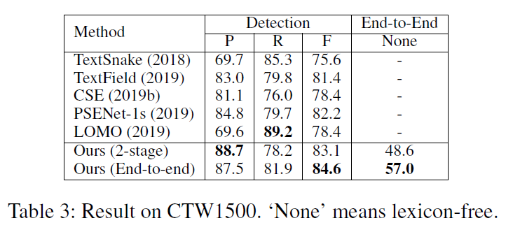

## Text Perceptron: Towards End-to-End Arbitrary-Shaped Text Spotting

#### 作者：Liang Qiao, Sanli Tang, Zhanzhan Cheng, Yunlu Xu, Yi Niu, Shiliang Pu, Fei Wu

#### 机构：Hikvision Research Institute, China; Zhejiang University, China

> 上一次end2end比较活跃还是19年的iccv，当时有三篇论文，一篇google的Towards Unconstrained End-to-End Text Spotting，一篇自动化所的textdragon，一篇阿德莱德的Convolutional Character Networks。这一次aaai又出了两篇end2end的论文。

检测里面有很多处理不规则文本的方法，但是它们对识别模块适应性不好，原因有两点：1.识别曲线文本效果不好。2.检测识别分开使得整个系统的结果是次优的。为了解决这两个问题，本文提出了Text Perceptron解决上面的问题。首先是**分割**，然后**Shape Transform Module用控制点**解决矫正问题，然后送入识别。在13、15、ctw1500、total上做了实验。

> end2end方法的动机好像没有特别大的创新，不是非端到端效果不好，就是检测和识别不匹配。
>
> 这里看到主要流程是分割，矫正和识别，流程和fots区别不大，检测换成了分割，roi rotate 换成了tps

### Introduction

检测结果已经取得了很大的进展，但是对于识别仍然有没解决问题：检测个识别的输入是bounding box，一般来说是一个水平矩形，对于不规则的文本就要求识别部分需要校正的能力。这种策略会从两个方面降低系统的性能：1.额外的矫正模块需要在识别网络中设计。这种矫正方法很难在无标注的情况下学习，同时会带来额外的计算代价（大雾）。2.这种流程不是端到端的，于是效果不好，这是因为识别模块的loss不能传到检测模块。

最近有两个端到端的方法，mask textspotter使用maskrcnn逐字符检测不规则文本。但是这个方法丢失了字符之间的语义信息，同时需要字符标注进行端到端的训练。TextNet使用透视变换roi pooling来处理不规则文本，他无法处理曲线文本。

> intorduction里面也是老生常谈的内容，作者这里对比了两个典型的end2end方法，不过看起来和以fots为代表的那套 检测-变换-识别的套路没有区别，唯一的改变是之前都是在改roi pooling，现在开始玩控制点了。
>
> 这一段看起来更像是relation works，不过他这里提到了TextNet是accv18仿照fots做的一个透视变换roi pooling，我当时还想复现这个东西来着，不过水平不够，速度太慢。但是看到觉得accv里面还是有一些蛮有意思的论文的

这些限制让作者寻找新的方法来解决，一个比较有意思的方法是TPS，但是STN来学TPS不好，他直接用crop rectangle来隐式的学习控制点，这样学习很困难。于是作者使用了一个新的思路来学习这些控制点，同时利用识别的损失来修正这些控制点。STM就负责来做这件事。它连接了检测和识别两个模块，解决了检测识别的不兼容问题。

Text Perceptron的主要构成如下：1.作者使用了一个分割模块来检测文本，他负责检测文本的文本区域的四个子区域：起点、终点、上、下，可以分开文本，同时可以确定阅读顺序。2.STM产生控制点并end2end的优化它，解决了检测识别不匹配的问题。3.一个序列识别模块

> 上下左右逇思路很早就有了，该分割目标可以看做pixel link 和text mountain的结合。不过值得注意的是，这里的上下是一起预测的，被称为boundary，起始终止的思路也很早就有了，具体的记不太清，不过有一篇特别秀的Start, Follow, Read: End-to-End Full-Page Handwriting Recognition
>
> STN包括控制点的思路最早是在aster引入文本识别的，他这里不引aster无可厚非，但是我相信他肯定是看了aster才产生的灵感，甚至这里不同STN来做TPS是想将该方法和aster区分开的一个设定，直到现在我还好奇他具体是怎么不用STN来做的。

本文的主要贡献如下：1.检测器能够确定识别顺序。2.STM实现了端到端。3.性能好

### Related Work

检测部分主要介绍了anchor的分割的方法，anchor的就不说了，和本文关系不大，分割的方法主要介绍了east、pse、Textfield、Textsnake

> 这里east被分到分割的方法里面了。这里介绍的分割方法和他的都不相关，所以也没对比。不过text field和它还是有点类似的

端到端的方法，这里作者分了几个阶段，首先是检测+识别，以textbox++为代表，然后使用变换模块将检测识别连起来，以fots为代表，再然后解决任意形状的文本问题，以TextNet为代表，但是他们都不能解决任意方向文本问题。最后mask textspotter尝试解决这个问题但是需要字符标注，同时丢失了序列识别的语义特征。

> 很遗憾作者没有和任何一个ICCV2019的方法来比，他们都可以处理任意形状文本的识别，而且截稿之前其实都出来了，不过可能作者就是iccv2019没中然后中了aaai2020

### Methodology

**本方法的主要结构**如上图所示：主要包括三部分：

检测部分主要包括resnet和fpn作为backbone，主要的分割任务为3个：包含阅读顺序的边界分类（4分类），角点回归和边界回归。

> 这里大概是借鉴了2阶段方法如faster rcnn或者是east的思想，加入回归来修正检测结果。这大概也就是east为什么被分到分割方法里面了吧，那这样其实faster rcnn anchor数量设为1也可以算分割方法，真是傻傻分不清。

STM迭代的在预测的分数图和集合热度图上产生控制点。然后利用TPS来矫正。

识别模块crnn和1d attention。

**检测任务：**检测模块第一个任务预测起始、终止、上下（boundary）、中心区域的点，主要看怎么生成gt。后面两个任务主要负责提高分割描述的准确度进行了二次回归。角点回归包含四个热度图，分类的对象是起始和终止区域的点，目标是他们到对应两个角点的x、y距离。边界回归任务同样四个热度图，分类的对象是中心区域的点上下左右四个方向到boundary的最近具体，具体可以见图3。计算loss的方法不是交叉熵，而是smooth l1。

**生成检测结果：**根据上面的预测值，怎么得到最后的检测结果呢？将中心区域、上下左右依次画到图上，中心区域自然就会被边界分开，同样起始终止也会被边界分开，于是每个中心区域就能和一个起始终止匹配上，对于多个匹配选择面积最大的，对于没有匹配的则丢弃。

**gt**：如图3(a)：1、4是head区域的2个角点，2、3是tail区域的2个脚垫。所有的数据集，1、4都是固定的，以为标注按照1为起点，顺时针来标的。对于ctw这种14个点的2、3也是固定的，对于2、3不固定的数据集，利用两个假设：1、其实和终止边是水平的，2.和tail边相邻的两个边夹角接近90°。来寻找2、3点。

对于四个区域的定义，利用了Wu and Natarajan 2017中的收缩和扩展思想，剩下的对着图其实可以看得很明白。

> 90°是textsnake提出来的假设，不是很懂为啥不完全按照text snake的来，有凑字数的嫌疑。同样，收缩方法也换了，个人觉得意义不是特别大。

集合回归gt的定义看图以及前面的说明就好了，很清楚直观，注意箭头的终点。

**控制点生成：**最重要的部分来了，输入分割图和上面回归的几何图，输出2xN个控制点。首先是4个角点，由对应区域的点和对应的偏差来计算他们的均值。一个例子，如图4，为了计算P1使用head区域（绿色）的点，计算如下：
$$
P_{1}=\left(\frac{\sum_{(x, y) \in \mathcal{R}_{\mathcal{H}}}(x+\Delta d x)}{\left\|\mathcal{R}_{\mathcal{H}}\right\|}, \frac{\sum_{(x, y) \in \mathcal{R}_{\mathcal{H}}}(y+\Delta d y)}{\left\|\mathcal{R}_{\mathcal{H}}\right\|}\right)，
$$
总结来说就是计算一个均值，知识看起来很大而已。对于其他的关键点利用二分法得到。如图4，找到一对对应点，如P1，PN，那么计算他们的水平跨度（横坐标的差）和竖直跨度，水平跨度长则沿着他们的中点做竖直线与边界交于$p\lfloor(N+1)/2\rfloor$，它的横坐标为$x_{m i d}=\frac{\lceil(N-1) / 2\rceil}{N-1} \times P_{1, x}+\frac{\lfloor(N-1) / 2\rfloor}{N-1} \times P_{N, x}​$，反之亦然。值得注意的是，这里的边界是中心区域和上面的回归结果得到的，首先作者定义了该点对应的环:
$$
\mathcal{B}_{\left\lfloor\frac{1+N}{2}\right\rfloor}=\left\{(x, y) \in \mathcal{R}_{\mathcal{C}} | x \in\left[x_{m i d}-\Delta e p, x_{m i d}+\Delta e p\right]\right\}
$$
$\Delta e p$是这个边界环的范围，是一个超参数。这个区域的点见图4中加深的红色区域。然后我们可以根据这个区域的点和回归值计算对应的y坐标:
$$
P_{\left\lfloor\frac{1+N}{2}\right\rfloor}=\left(x_{m i d}, \frac{\sum_{\left.\left(x_{t}, y_{t}\right) \in \mathcal{B}_{\lfloor\frac{1+N}{2}\rfloor} \right.} y_{t}+\Delta d y_{t}^{\prime}}{\left\|\mathcal{B}_{\left\lfloor\frac{1+N}{2}\right\rfloor}\right\|}\right)
$$
这个公式看起来就更复杂了，其实本质是$y+\Delta dy$求平均，依旧是一个平均。

得到了控制点之后剩下的过程包括TPS以及梯度回传以及loss设置，没什么特别的贡献，这里就不详细说明了。

> 不过虽然没什么新的东西，但是确实进一步的强调了我的识别模块的loss就是可以通过TPS回传到检测模块，同时这种写公式的功底也值得我们去学习。

### Experiments

实验就不多说了，看图即可，主要是13、15、total、ctw上的实验。

值得注意的是这里有一个关于控制点数量的ablation study。作者在这里的分析结果是对于常规数据集IC15来说，4个点就够了，多了没有啥变化，对于曲线来说，控制点的数量不应该少于10个，多了之后基本稳定。